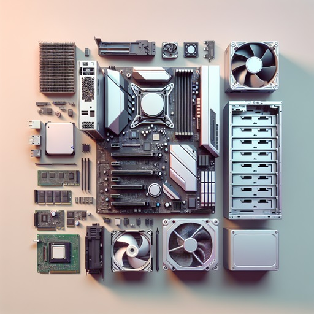

# Der Computer, seine Komponenten und Funktionsweise

Dieser Unterrichtsentwurf ist geeignet für die **Stufe 7 bis 10** und ist für **4 Einheiten zu je 90 Minuten** ausgelegt. 

Für die dritte Einheit bieten wir Ihnen einen Besuch durch Mitarbeiter der Fachhochschule Westküste an Ihrer Schule an, zu der wir etwa 10 ausrangierte Rechner und Werkzeug mitbringen. Den Schülerinnen und Schülern bieten wir die Möglichkeit, die Rechner zu zerlegen, eine Fotodokumentation der einzelnen Komponenten durchzuführen und unter Anleitung wieder zusammenzubauen. Bei Bedarf können Sie für die erste und zweite Einheit ebenfalls auf unsere Expertise zurückgreifen.

|Nr.| Einheit |Inhalte|
|---|---|---|
|1| Die Funktionsweise eines Computers |EVA-Prinzip: Eingabe, Verarbeitung, Ausgabe, Rechnerarchitekturen|
|2| Funktion und Zusammenwirken von Computerkomponenten |Prozessor, Arbeitsspeicher, Mainboard, Netzwerkkomponenten, Grafikkarte, Laufwerke, Netzteil, Peripheriegeräte, Sensoren und Eingabegeräte, Aktoren und Ausgabegeräte|
|3| Computer zerlegen, dokumentieren und wieder zusammenbauen | Verfestigen der gelernten Inhalte |
|4| Reflexion und Analogie zu anderen Geräten |Erstellung eines Plakates, Analogie zu anderen Geräten: Smartphone, Fernseher, Konsolen, Auto|

---

## Einheit 1: Die Funktionsweise eines Computers

### Lernziele:
- Die Schüler*innen verstehen das EVA-Prinzip (Eingabe, Verarbeitung, Ausgabe).
- Die Schüler*innen können einfache Rechnerarchitekturen beschreiben.

### Unterrichtsablauf

#### 1. Einstieg (15 Minuten)
- **Begrüßung und Zielsetzung**: Begrüßung der Schüler*innen und Vorstellung der heutigen Lernziele.
- **Brainstorming**: Kurze Diskussion über die Frage: "Was ist ein Computer und wofür wird er verwendet?"

#### 2. Erarbeitung I: Das EVA-Prinzip (15 Minuten)
- **Erklärung des EVA-Prinzips**: 
  - **Eingabe (E)**: Erklärung, was Eingabegeräte sind (z.B. Tastatur, Maus, Mikrofon).
  - **Verarbeitung (V)**: Erklärung, wie die Daten im Computer verarbeitet werden, ohne dabei auf die Architektur eines Rechners einzugehen.
  - **Ausgabe (A)**: Erklärung, was Ausgabegeräte sind (z.B. Monitor, Drucker, Lautsprecher).

#### 3. Übung und Anwendung (20 Minuten)
- **Gruppenarbeit**: Die Schüler*innen werden in kleine Gruppen aufgeteilt und erhalten die Aufgabe, Alltagsbeispiele zu identifizieren, die das EVA-Prinzip verdeutlichen (z.B. Taschenrechner, Ampelanlage).
- **Diskussion**: Gemeinsames Durchgehen der von den Schüler*innen erarbeiteten Alltagsbeispiele.

#### 4. Erarbeitung II: Rechnerarchitekturen (30 Minuten)
- **Grundsätzliches Prinzip einer Verarbeitung**:
  - **Programmspeicher**: Erklärung, dass der Programmspeicher das auszuführende Programm enthält.
  - **Programm Counter**: Erklärung, dass der Programm Counter auf die aktuell auszuführende Codezeile zeigt.
  - **Recheneinheit**: Erklärung, dass die Recheneinheit den aktuellen Befehl ausführt. Ein Befehl kann das Berechnen einer Rechenaufgabe sein, das Ausgeben eines Buchstabens auf dem Bildschirm oder das Einlesen einer Mausbewegung.
  - **Datenspeicher**: Erklärung, dass im Datenspeicher Ergebnisse von Berechnungen abgelegt werden oder Bilder, Dokumente oder Ähnliches abgelegt werden können.

Das Arbeitsprinzip kann an einem Beispiel erklärt werden, bei dem im Programmspeicher eine Befehlsfolge abgearbeitet werden soll, in der zwei Zahlen aus dem Datenspeicher geladen, in der Recheneinheit addiert und anschließend an eine dritte Stelle im Datenspeicher gespeichert werden.

- **Rechnerarchitektur eines modernen Personal Computers**:
  - **Gemeinsamer Daten- und Programmspeicher**: Erklärung, dass moderne Personal Computer (PC) nach der *Von-Neumann-Architektur* aufgebaut sind. In dieser Architektur existiert ein gemeinsamer Speicher, der sowohl die Computerprogrammbefehle als auch die Daten speichert.
  - **Unterscheidung von schnellem flüchtigem und langsamem nicht-flüchtigem Speicher**: Erklärung, dass zwei Typen von Speicher in PCs vorgehalten werden: ein schneller flüchtiger Speicher, der sogenannte Arbeitsspeicher, und ein nicht-flüchtiger langsamer Speicher, die sogenannte Festplatte. Flüchtiger Speicher bedeutet, dass die Daten nach dem Ausschalten des Rechners verloren gehen. Nicht-flüchtiger Speicher behält seine Daten auch, wenn der PC ausgeschaltet ist. Das Programm und die zu bearbeitenden Daten werden in der Regel erst in den Arbeitsspeicher kopiert und dann fängt der Rechner an, das Programm abzuarbeiten.

#### 5. Zusammenfassung und Reflexion (10 Minuten)
- **Wiederholung der Lernziele**: Kurze Wiederholung der wichtigsten Punkte des Unterrichts.
- **Fragen und Antworten**: Möglichkeit für die Schüler*innen, Fragen zu stellen.
- **Abschluss**: Kurze Reflexion über das Gelernte und Ausblick auf die nächste Stunde.

### Materialien
- Whiteboard/Smartboard/Tafel
- [Online Arbeitsblatt für Einheit 1](https://github.com/FHW-Appel/Moin-MINT/wiki/Der-Computer#einheit-1-die-funktionsweise-eines-computers)

## Einheit 2: Funktion und Zusammenwirken von Computerkomponenten

### Lernziele:
- Die Schüler*innen kennen die grundlegenden Computerkomponenten und deren Funktionen.
- Die Schüler*innen verstehen, wie die verschiedenen Komponenten zusammenarbeiten.
- Die Schüler*innen können eigenständig Informationen recherchieren und präsentieren.

### Unterrichtsablauf

#### 1. Einstieg (10 Minuten)
- **Begrüßung und Zielsetzung**: Begrüßung der Schüler*innen und Vorstellung der heutigen Lernziele.
- **Kurze Einführung**: Überblick über die wichtigsten Computerkomponenten und deren Bedeutung.

#### 2. Erarbeitung I: Einführung in die Computerkomponenten (20 Minuten)
- **Prozessor (CPU)**: 
  - **Funktion**: Der Prozessor ist das "Gehirn" des Computers und führt Berechnungen und Befehle aus.
- **Arbeitsspeicher (RAM)**: 
  - **Funktion**: Der RAM speichert temporäre Daten, die der Prozessor schnell abrufen kann.
- **Mainboard**: 
  - **Funktion**: Das Mainboard verbindet alle Komponenten miteinander und ermöglicht die Kommunikation zwischen ihnen.
- **Netzwerkkomponenten**: 
  - **Funktion**: Netzwerkkomponenten wie Netzwerkkarten und Router ermöglichen die Verbindung des Computers mit anderen Geräten und dem Internet.
- **Grafikkarte**: 
  - **Funktion**: Die Grafikkarte verarbeitet und rendert Bilder und Videos, die auf dem Monitor angezeigt werden.
- **Laufwerke (HDD/SSD)**: 
  - **Funktion**: Laufwerke speichern dauerhaft Daten und Programme.
- **Netzteil**: 
  - **Funktion**: Das Netzteil versorgt den Computer mit Strom.
- **Peripheriegeräte**: 
  - **Funktion**: Peripheriegeräte wie Tastatur, Maus und Drucker ermöglichen die Interaktion mit dem Computer.
- **Sensoren und Eingabegeräte**: 
  - **Funktion**: Sensoren und Eingabegeräte erfassen physische Daten und Eingaben, z.B. Temperatur, Bewegungen oder Tastenanschläge.
- **Aktoren und Ausgabegeräte**: 
  - **Funktion**: Aktoren und Ausgabegeräte setzen digitale Signale in physische Aktionen um, z.B. Monitore oder Lautsprecher.

#### 3. Erarbeitung II: Gruppenarbeit mit Internetrecherche (30 Minuten)
- **Einführung in die Aufgabe**: Die Schüler*innen werden in Gruppen aufgeteilt und erhalten die Aufgabe, zu einer der genannten Komponenten detaillierte Informationen zu recherchieren (Funktion, Bedeutung, Beispiele).
- **Internetrecherche**: Die Gruppen nutzen Computer oder Tablets, um im Internet nach Informationen zu suchen.
- **Dokumentation der Recherche**: Jede Gruppe erstellt eine Dokumentation ihrer Recherche. Dies kann in Form einer kurzen Präsentation (z.B. auf einem Plakat oder in einer PowerPoint-Präsentation) oder in einem Word-Dokument erfolgen.

#### 4. Präsentation und Diskussion (20 Minuten)
- **Präsentation der Gruppenarbeiten**: Jede Gruppe präsentiert ihre Ergebnisse vor der Klasse.
- **Diskussion**: Nach jeder Präsentation gibt es eine kurze Diskussionsrunde, in der Fragen gestellt und Unklarheiten geklärt werden können.

#### 5. Zusammenfassung und Reflexion (10 Minuten)
- **Wiederholung der Lernziele**: Kurze Wiederholung der wichtigsten Punkte des Unterrichts.
- **Fragen und Antworten**: Möglichkeit für die Schüler*innen, Fragen zu stellen.
- **Abschluss**: Kurze Reflexion über das Gelernte und Ausblick auf die nächste Stunde.

### Materialien
- Whiteboard/Smartboard
- Computer oder Tablets für die Internetrecherche
- Plakatpapier und Stifte für die Gruppenarbeit
- [Online Arbeitsblatt für Einheit 2](https://github.com/FHW-Appel/Moin-MINT/wiki/Der-Computer#einheit-2-funktion-und-zusammenwirken-von-computerkomponenten)

### Anmerkungen
Hier sind einige vertrauenswürdige Internetquellen, die für die Recherche zu den verschiedenen Computerkomponenten genutzt werden können:

1. **Wikipedia**: Eine umfassende Quelle für allgemeine Informationen über Computerkomponenten.
   - [Wikipedia - Personal Computer](https://de.wikipedia.org/wiki/Personal_Computer)
   - [Wikipedia - Prozessor (CPU)](https://de.wikipedia.org/wiki/Prozessor)
   - [Wikipedia - Arbeitsspeicher (RAM)](https://de.wikipedia.org/wiki/Arbeitsspeicher)
   - [Wikipedia - Mainboard](https://de.wikipedia.org/wiki/Mainboard)
   - [Wikipedia - Netzwerkkomponenten](https://de.wikipedia.org/wiki/Netzwerkkomponente)
   - [Wikipedia - Grafikkarte](https://de.wikipedia.org/wiki/Grafikkarte)
   - [Wikipedia - Festplatte (HDD)](https://de.wikipedia.org/wiki/Festplatte)
   - [Wikipedia - Solid-State-Drive (SSD)](https://de.wikipedia.org/wiki/Solid-State-Drive)
   - [Wikipedia - Netzteil](https://de.wikipedia.org/wiki/Netzteil)
   - [Wikipedia - Peripheriegeräte](https://de.wikipedia.org/wiki/Peripheriegerät)
   - [Wikipedia - Sensoren und Aktoren](https://de.wikipedia.org/wiki/Sensor)

## Einheit 3: Computer zerlegen, dokumentieren und wieder zusammenbauen

### Lernziele:
- Die Schüler*innen lernen die grundlegenden Komponenten eines Computers kennen.
- Die Schüler*innen verstehen die Funktion und den Zusammenbau der einzelnen Computerkomponenten.
- Die Schüler*innen üben Teamarbeit und Dokumentationstechniken.

### Unterrichtsablauf

#### 1. Einstieg (10 Minuten)
- **Begrüßung und Zielsetzung**: Begrüßung der Schüler*innen und Vorstellung der heutigen Lernziele.
- **Einführung**: Kurze Erklärung der Aufgabe und der Sicherheitsregeln beim Umgang mit Computerhardware (z.B. ESD-Schutz, Vorsicht bei scharfen Kanten).

#### 2. Gruppenbildung und Aufgabenverteilung (10 Minuten)
- **Gruppenbildung**: Die Schüler*innen finden sich in Gruppen von 2-3 Personen zusammen.
- **Aufgabenverteilung**: Jede Gruppe einigt sich auf die Verantwortungsbereiche:
  - **Zerlegen und Zusammenbau**: Verantwortlich für das physische Zerlegen und den Wiederzusammenbau des Computers.
  - **Fotodokumentation**: Verantwortlich für die fotografische Dokumentation jedes Schrittes.
  - **Notizen**: Verantwortlich für das schriftliche Festhalten der einzelnen Schritte und der identifizierten Komponenten.

#### 3. Erarbeitung I: Computer zerlegen (40 Minuten)
- **Zerlegen des Computers**: Die Gruppen beginnen mit dem Zerlegen der Computer. Dabei sollen sie systematisch vorgehen und jede Komponente fotografieren und notieren.
  - **Schritte**:
    1. Entfernen des Gehäusedeckels.
    2. Ausbau der Festplatte/SSD und anderer Laufwerke (DVD etc.).
    3. Ausbau der Grafikkarte (falls vorhanden).
    4. Ausbau des Arbeitsspeichers (RAM).
    5. Ausbau des CPU-Kühlers.
    6. Ausbau des Netzteils.
    7. Ausbau der CPU.
    8. Ausbau des Mainboards.
- **Dokumentation**: Die Schüler*innen machen Fotos und Notizen zu jedem Schritt und jeder Komponente.

#### 4. Erarbeitung II: Wiederzusammenbau des Computers (30 Minuten)
- **Beginn des Wiederzusammenbaus**: Etwa 30 Minuten vor Ende der Unterrichtseinheit beginnen die Gruppen mit dem Wiederzusammenbau des Computers.
  - **Schritte**:
    1. Einbau des Mainboards.
    2. Einbau der CPU.
    3. Einbau des Netzteils.
    4. Einbau des CPU-Kühlers.
    5. Einbau des Arbeitsspeichers (RAM).
    6. Einbau der Grafikkarte (falls vorhanden).
    7. Einbau der Festplatte/SSD und anderer Laufwerke (DVD etc.).
    8. Schließen des Gehäuses.
- **Überprüfung**: Jede Gruppe überprüft, ob alle Komponenten korrekt eingebaut sind.

### Materialien
- Ausrangierte Computer (1 pro Gruppe)
- Schraubendreher-Sets
- Tablets oder Smartphones für die Fotodokumentation
- Notizblöcke und Stifte für die schriftliche Dokumentation
- [Online Arbeitsblatt für Einheit 3](https://github.com/FHW-Appel/Moin-MINT/wiki/Der-Computer#einheit-3-computer-zerlegen-dokumentieren-und-wieder-zusammenbauen)
- Alternativ das [Arbeitsblatt 3](AB3_Rechneraufbau.pdf) zum ausdrucken.

## Einheit 4: Reflexion und Analogie zu anderen Geräten

### Lernziele:
- Die Schüler*innen reflektieren die in den letzten drei Einheiten gelernten Inhalte.
- Die Schüler*innen erstellen ein digitales Plakat, das die wichtigsten Informationen und Dokumentationen zusammenfasst.
- Die Schüler*innen erkennen die Präsenz und Bedeutung von Computern in anderen Geräten des Alltags.

### Unterrichtsablauf

#### 1. Einstieg (10 Minuten)
- **Begrüßung und Zielsetzung**: Begrüßung der Schüler*innen und Vorstellung der heutigen Lernziele.
- **Rückblick**: Kurze Wiederholung der in den letzten drei Stunden behandelten Themen (Computerkomponenten, deren Funktionen und der praktische Umgang mit Hardware).

#### 2. Erarbeitung I: Plakaterstellung (40 Minuten)
- **Einführung in die Aufgabe**: Erklärung der Aufgabe, ein digitales Plakat zu erstellen, das die wichtigsten Informationen und Dokumentationen der letzten drei Stunden zusammenfasst.
- **Materialverteilung**: Verteilen von Tablets oder die Zuweisung von PCs, an den die Plakate erstellt werden können.
- **Plakaterstellung**: Die Schüler*innen arbeiten in Gruppen (wie in den letzten Stunden) und gestalten ihr Plakat. Dabei sollen sie:
  - Die Funktion und Bedeutung der einzelnen Computerkomponenten darstellen.
  - Die gemachten Fotos und Notizen verwenden.
  - Kreativ und übersichtlich arbeiten, um die Informationen ansprechend darzustellen.

#### 3. Erarbeitung II: Analogie zu anderen Geräten (20 Minuten)
- **Einführung in die Aufgabe**: Erklärung der Aufgabe, darüber nachzudenken und zu diskutieren, wo in anderen Geräten wie Smartphones, Fernsehern, Konsolen oder Autos Computer verbaut sind.
- **Gruppenarbeit**: Die Schüler*innen diskutieren in ihren Gruppen und erstellen eine Liste von Beispielen, in denen Computertechnologie in Alltagsgeräten verwendet wird.
  - **Beispiele**:
    - **Smartphone**: zusätzliche Sensoren (z.B. Gyroskop, Beschleunigungssensor).
    - **Fernseher**: zusätzlicher Satelliten- und Rundfunkempfänger.
    - **Konsole**: identisch zu PC.
    - **Auto**: Steuergeräte, Sensoren (z.B. ABS-Sensoren, Airbag-Sensoren), Infotainmentsystem.

#### 4. Präsentation und Diskussion (15 Minuten)
- **Präsentation der Plakate**: Jede Gruppe stellt ihr Plakat kurz vor der Klasse vor und erklärt die wichtigsten Punkte.
- **Diskussion**: Gemeinsame Reflexion über die Erkenntnisse aus den Plakaten und der Analogie zu anderen Geräten. Fragen und Anmerkungen der Mitschüler*innen werden besprochen.

#### 5. Zusammenfassung und Reflexion (5 Minuten)
- **Wiederholung der Lernziele**: Kurze Wiederholung der wichtigsten Punkte des Unterrichts.
- **Fragen und Antworten**: Möglichkeit für die Schüler*innen, Fragen zu stellen.
- **Abschluss**: Kurze Reflexion über das Gelernte und Ausblick auf die nächste Stunde.

### Materialien
- Tablet oder PCs
- Gesicherte Fotos und Notizen der letzten Stunde.
- Beamer, um die Plakate zu präsentieren.
- Whiteboard/Smartboard für die Diskussion
- [Online Arbeitsblatt für Einheit 4](https://github.com/FHW-Appel/Moin-MINT/wiki/Der-Computer#einheit-4-reflexion-und-analogie-zu-anderen-ger%C3%A4ten)

---

# Kompetenzvermittlung

Bezogen auf die [Fachanforderungen des Landes Schleswig-Holstein](https://fachportal.lernnetz.de/files/Fachanforderungen%20und%20Leitf%C3%A4den/Sek.%20I_II/Fachanforderungen/21-14520%20Fachanforderungen%20Informatik%20SEK_WEB_PDF%20UA.pdf) werden die folgenden Kompetenzen vermittelt.

## Prozessbezogene Kompetenzen

### Kommunizieren über informatische Themen:

- Die Schüler*innen verwenden die nötige Fachsprache.
- Die Schüler*innen diskutieren Informatikmodelle.
- Die Schüler*innen präsentieren Unterrichtsergebnisse und diskutieren diese.

## Inhaltsbezogene Kompetenzen

### Sekundarstufe I

|Nr.| Die Schüler*innen ... | Inhalte|
|---|---|---|
|I2|... verwenden persönliche Geräte sachgerecht in vielfältigen Anwendungssituationen|Aufbau und Einsatzzweck von: persönlichen Geräten (Personal Computer, Notebook, Tablet, Smartphone) Peripheriegeräten Smart-Devices im persönlichen Umfeld|
|I3|... nennen Anwendungsbereiche für verschiedene persönliche Geräte | wie I2 |
|I7|... nennen Hardwarekomponenten und ihre Funktion.|Hardware, Sensoren und Eingabegeräte, Prozessoren, Befehlszyklus, Speicher, flüchtiger und permanenter Speicher, Netzwerkkomponenten, Aktoren und Ausgabegeräte|
|I8|... klassifizieren Hardwarekomponenten.|wie I7|
|I9|... erklären die grundlegende Funktionsweise von Hardwarekomponenten und deren Zusammenwirken| wie I7|

### Sekundarstufe II

|Nr.| Die Schüler*innen ... | Inhalte|
|---|---|---|
|BK4|... erklären die grundlegende Funktionsweise von Hardwarekomponenten und deren Zusammenwirken.|Sensoren und Eingabegeräte, Prozessoren, Speicher, Netzwerkkomponenten, Aktoren und Ausgabegeräte|