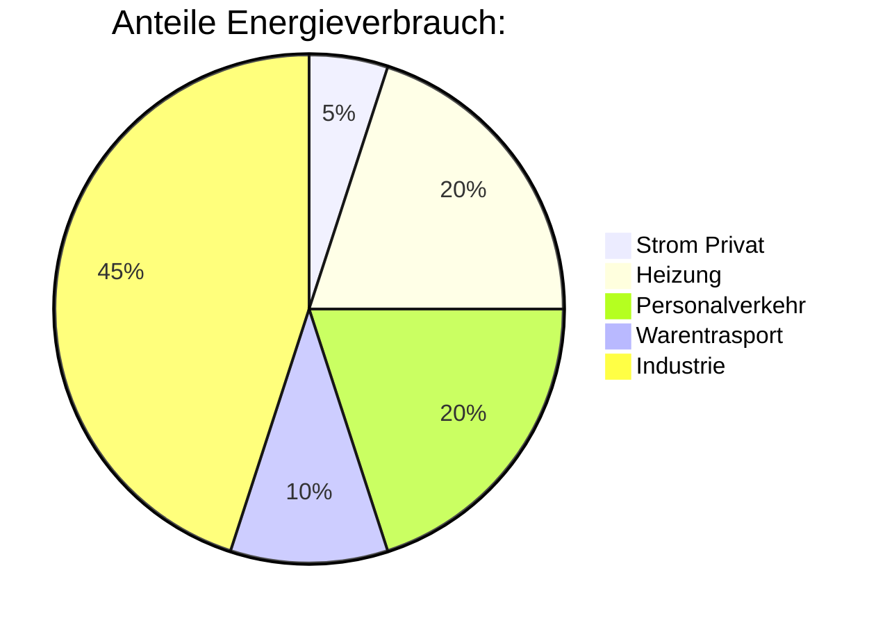
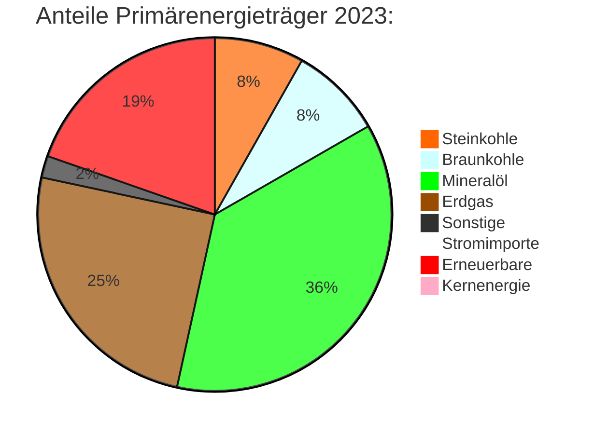
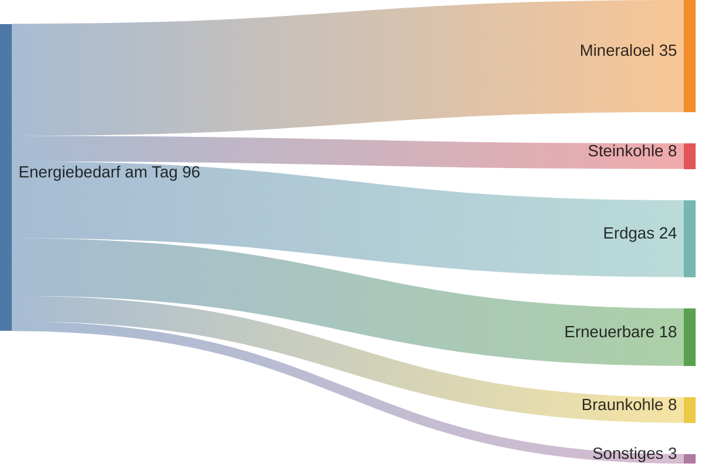
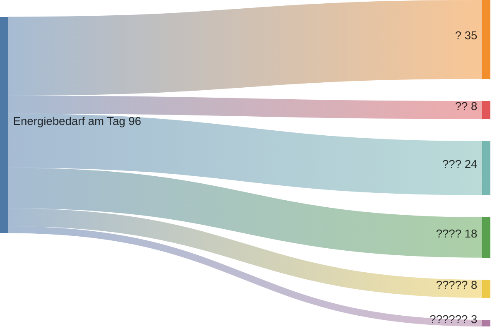
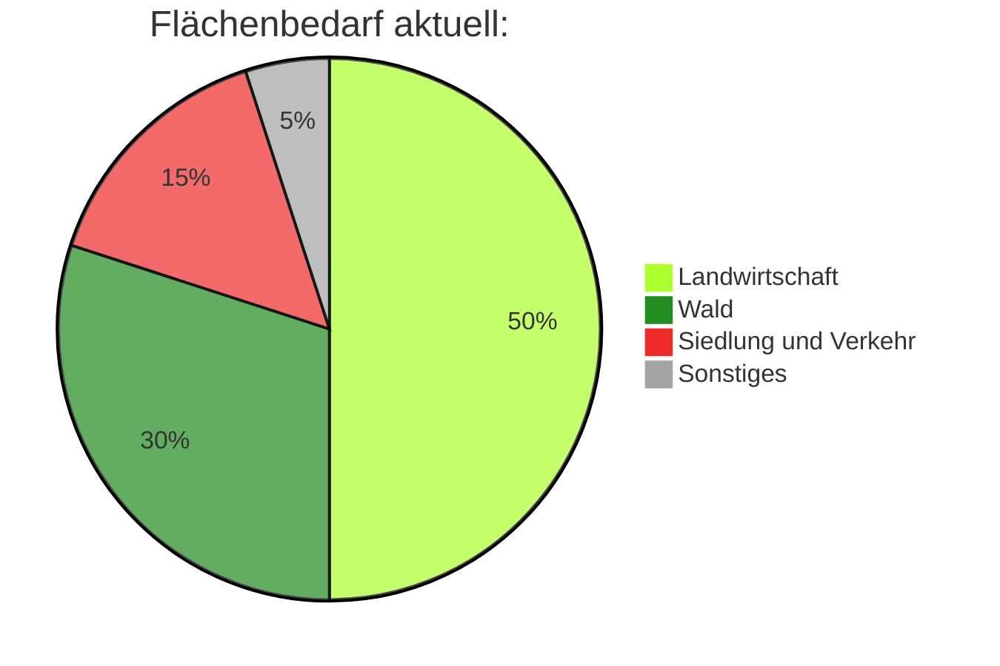

Dieser Unterrichtsentwurf ist geeignet für die **Stufe 10 bis 12** und besteht aus drei Einheiten, die jeweils 90 Minuten dauern. Ziel ist es, den Schülerinnen und Schülern (SuS) ein fundiertes Verständnis von Energie, ihren Quellen, ihrem Verbrauch und den Herausforderungen bei Transport und Speicherung zu vermitteln.

Ursprünglich war der folgende Text als Unterrichtsentwurf geplant. Beim Verfassen des Textes ist jedoch schnell aufgefallen, dass sehr viele Berechnungen und Fakten nötig sind. Daraus entstand der Anspruch der Leserin bzw. dem Leser diese Berechnungen und Fakten innerhalb des Textes aufzuarbeiten. Daher eignet dieser Text sich auch als Nachschlagewerk für Lehrkräfte. Zwischen den vielen Berechnungen und Informationen werden Vorschläge für die Einbindung der Inhalte in den Unterricht dargeboten. Die Lehrkräfte können sich dieser Vorschläge annehmen, diese umändern oder nur ein Teil der Inhalte vermittel. Der Umfang der Inhalte ist sehr groß. Dies war initial nicht beabsichtigt, dennoch hat dies, die ernsthafte Auseinandersetzung mit dem Thema erfordert. Ich wünsche Ihnen viel Freude bei der Lektüre, mir hat das Verfassen große Freude bereitet.   

|Nr.| Einheit |Inhalte|
|---|---|---|
|1| Was ist Energie und wie viel ist viel? | Energie und verrichtete Arbeit, Maßeinheiten und Einschätzung von Größenordnung, Unser täglicher Verbrauch|
|2| Energieträger, die uns zur Verfügung stehen | Fossile Energieträger, regenerative Energielieferanten, Energiewende|
|3| Energietransport und Speicherung | Stromtrassen, Pipelines, Frachtverkehr, elektrische Speicher, synthetische Kraftstoffe |

# Einheit 1: Was ist Energie und wie viel ist viel?

## Lernziele
- Verständnis des Begriffs "Energie" und der Einheit "Kilowattstunde".
- Praktische Anwendung durch Berechnungen des Energieverbrauchs bei alltäglichen Aktivitäten.
- Schätzung und Berechnung des täglichen Energiebedarfs eines Bundesbürgers.
- Verständnis des aktuellen Energiemixes in Deutschland.
- Einführung in Primär-, Sekundär- und Endenergiebedarf.

## 1. Energie und die Einheit Kilowattstunde (kW h) (5 Minuten)
Die Unterrichtseinheit beginnt mit der Frage: Was ist Energie? 

Eine mögliche Antwort lautet: Energie ist die Fähigkeit, Arbeit zu verrichten oder Wärme zu erzeugen. Sie tritt in verschiedenen Formen auf, z.B. mechanische, thermische, elektrische und chemische Energie.

Diese korrekte Antwort hilft den SuS jedoch nicht ein Verständnis von Energie zu entwickeln. Daher kann weiter gefragt werden: Wie messen wir Energie? Wo habt ihr schon mal von einem Energiemessinstrument gehört?

Die Antwort Stromzähler und Kilowattstunde kommt dann sehr schnell.

## 2. Wie viel Arbeit kann ein Mensch am Tag verrichten (20 Minuten)

Frage an die SuS: Wie viel Arbeit bzw. Energie seid Ihr in der Lage an einem Tag zu verrichten.

Berechnung über die potenzielle Energie. Wir wollen eine Bergwandertour machen und möglichst hoch hinaussteigen. Wie hoch schaffen wir es an einem Tag? Die SuS sollen schätzen wie hoch Sie in der Lage sind an einem Tag zu wandern. 

Die Schätzungen werden mit den Höhenmetern vergleichen die eine Person mit durchschnittlichen Gewicht für eine Kilowattstunde erreichen kann. Die Formel für die potenzielle Energie lautet: 

$$E_\mathrm{pot} = m \cdot g \cdot h$$

Umgestellt nach der Höhe lautet die Formel:

$$h = \frac{E_\mathrm{pot}}{m \cdot g}$$

Nimmt man ein SuS Gewicht von $65 \\, \mathrm{kg}$ an, dann errechnet sich eine Höhe wie folgend:

$$h = \frac{1 \\, \mathrm{kWh}}{65 \, \mathrm{kg} \cdot 9,81 \, \mathrm{\frac{m}{s^2}}}$$

Umrechnung in Wattsekunden:

$$h = \frac{3 \, 600 \, \mathrm{kWs}}{65 \, \mathrm{kg} \cdot 9,81 \, \mathrm{\frac{m}{s^2}}}$$

$$h = \frac{3 \, 600 \,  000 \, \mathrm{Ws}}{65 \, \mathrm{kg} \cdot 9,81 \, \mathrm{\frac{m}{s^2}}}$$

Umformen in SI-Einheiten:

$$h = \frac{3 \, 600 \,  000 \, \mathrm{\frac{kg \, m^2}{s^3}s}}{65 \, \mathrm{kg} \cdot 9,81 \, \mathrm{\frac{m}{s^2}}}$$
Ausgerechnet:

$$h = 5 \, 646 \, \mathrm{m}$$

Dies ist eine Höhe, die nur mit sehr viel Training an einem Tag vollbracht werden kann.

Eine weitere Möglichkeit zu ermitteln, was ein Mensch in der Lage ist an einem Tag an Arbeit zu verrichten, ist über ein Leistungsmesser (Powermeter) an einem Fahrrad oder an einem Hometrainer. Ein gut trainierter Sportler schafft hier 100 Watt Leistung über längere Zeit zu halten. Um eine Kilowattstunde zusammenzubringen müsste der Sporter 10 Stunden durchtreten.

## 3. Vergleich mit Alltagsaktivitäten  (10 Minuten)

Am Ende des Wandertages möchte der Sportler und auch der Wanderer gerne warm duschen. Wie viel Energie wird für eine warme Dusche benötigt? Auch das ist leicht nach der folgenden Formel zu berechnen:

$$E_\mathrm{th} = m \cdot c \cdot \Delta T $$

Umgestellt nach der Masse lautet die Formel:

$$m  = \frac{E_\mathrm{th}}{c \cdot \Delta T}$$

Mit der Wärmekapazitätskonstante $c = 4,2 \, \mathrm{\frac{kW \, s}{kg \, K}}$ und einer Kaltwasserausgangstemperatur von $15 \, °C$ und einer angenehmen Duschtemperatur von $37 \, °C$ ergibt nach

$$m  = \frac{3 \, 600 \, \mathrm{kW \, s}}{4,2 \, \mathrm{\frac{kW \, s}{kg \, K}} \cdot 22 \, °C} \approx 39 \, \mathrm{kg}$$

Das entspricht etwa $39 \, \mathrm{L}$ Wasser und mit einer Durchlaufmenge von $13 \, \mathrm{\frac{L}{min}}$ kann für eine Kilowattstunde gerade mal drei Minuten lang warm geduscht werden.

Würde der Sportler sein Hometrainer an einen Dynamo anschließen und den erzeugten Strom als regenerativen Strom verkaufen wollen, so würde er einen Stundenlohn erhalten, der weit unter 10 Cent pro Stunde liegt.

## 4. Schätzung des täglichen Energiebedarfs (5 Minuten)
SuS schätzen ihren täglichen Energiebedarf basierend auf ihren Aktivitäten.

## 5. Berechnung des tatsächlichen Bedarfs (20 Minuten)
### Jahresverbrauch in Deutschland:

Um den Jahresenergiebedarf der Bundesrepublick Deutschland zu ermitteln können die SuS aufgefordert werden dies im Internet zu rechachieren.
- Eine Mögliche Quelle ist [Wikipedia Energiebilanz (Energiewirtschaft)](https://de.wikipedia.org/wiki/Energiebilanz_(Energiewirtschaft))
- oder die [Angaben der AG Energiebilanzen e.V.](https://ag-energiebilanzen.de/energieverbrauch-faellt-kraeftig-weiterer-ausbau-der-erneuerbaren/)

Bei der Recherche stelle die SuS schnell fest, dass unterschiedliche Werte angegeben werden:
- Primärenergieverbrauch 2023: $10 \, 629 \, \mathrm{PJ}$ (Petajoule)
- Endenergieverbrauch 2023: $8 \, 163 \, \mathrm{PJ}$

Diese Begriffe müssen erst geklärt werden, damit verstanden werden kann, wie mit diesen Zahlen umgegangen werden kann.

Anhand der folgenden Grafik können die Umwandlungsverluste erklärt werden:

> Railweh10, CC BY-SA 3.0 <https://creativecommons.org/licenses/by-sa/3.0>, via Wikimedia Commons

Der Primärergieverbrauch ist somit der Energiebedarf den wir inklusive Umwandlungsverluste benötigen.

### Pro-Kopf-Verbrauch pro Tag:

Um den Pro-Kopf-Verbrauch pro Tag zu ermitteln müssen wir Petajoule in Kilowattstunden umrechnen:

$$1 \, \mathrm{kWh} = 1 \, 000 \, \mathrm{Wh} = 3,6 \cdot 10^6 \, \mathrm{Ws} = 3,6 \cdot 10^6 \, \mathrm{J}$$

$$1 \, \mathrm{PJ} = 10^{15} \mathrm{J}$$

Anschließend kann der Jahresenergieverbrauch in den Tagesenergieverbrauch umgerechnet werden:

- 1 Jahr entspricht 365 Tage

Und schließlich durch die Anzahl der Bundesbürger geteilt werden:
 - $84 \, 669 \, 000$ im Jahr 2023

Mit den gefundenen Werten kann der Pro-Kopf-Verbrauch pro Tag in Kilowattstunden berechnet werden:
  - Primärenergieverbrauch 2023: $96 \, \mathrm{kW \, h}$
  - Endenergieverbrauch 2023: $73 \, \mathrm{kW \, h}$

Man kann sagen, dass wir ein Konsumleben führen, welches der Arbeitskraft von 96 Menschen entspricht.

Das ist doppelt so viel wie der weltweite durchschnitt.

Etwa halb so viel wie der weltweite Spitzenreiter (USA)

## 6. Diskussion der Bestandteile des Energieverbrauchs (15 Minuten)

Den Schülern wird die folgende Grafik gezeigt und es solle eine offene Diskussion darüber geführt werden, für welche Anteile wir selbst verantwortlich sind.

Wir sind für alle Anteile verantwortlich, da wir über unser Konsumverhalten auch für den Warentransport und für die nötige Energie bei der Herstellung von Konsumgütern verantwortlich sind.

## 7. Diskussion der Bestandteile der Primärenergie (15 Minuten)

Den Schülern wird die folgende Grafik gezeigt:

> Quelle: [Energiebilanz Deutschland, AG Energiebilanzen e.V.](https://ag-energiebilanzen.de/wp-content/uploads/2023/11/awt_2023_d.pdf)

Aus den gezeigten Anteilen soll von den SuS errechnet werden, wie viel Kilowattstunden der entsprechenden Energiequelle von jeden von uns pro Tag verursacht werden. Gerundet wird auf ganze Kilowattstunden

# Einheit 2: Energieträger, die uns zur Verfügung stehen

## Lernziele
Analyse der verfügbaren Energiequellen und ihrer Herausforderungen.

## 1. Wiederholung der letzten Einheit (10 Minuten)
- Wie hoch ist der Energiebedarf pro Bundesbürger pro Tag?
- Was ist der Unterschied zwischen Primärenergie und Endenergie?
- Aus welchen Energielieferanten stillen wir aktuell unseren Energiebedarf?
- Welche Anteile am Gesamtenergieverbrauch sind durch uns selbst verursacht? 

## 2. Einführung generelle Vorgehensweise (10 Minuten)
### Energieanteile bestimmen:

Nachdem in der letzten Lehreinheit der Energiebedarf je Bundesbürger pro Tag bestimmt wurde und dieser Bedarf ins Verhältnis zu den Energiequellen gesetzt wurde, soll in dieser Einheit ermittelt werden, in wie weit diese Anteile verändert werden könnte.

Hierzu soll eine persönliche Energiebilanz erstellt werden. Es wird erst einmal davon ausgegangen, dass sich der Gesamtbedarf je Bundesbürger nicht weiter reduziert. Die Ansätze der freiwilligen persönlichen Beschränkungen können anhand der Erfahrungen in den letzten Jahren als nicht ausreichend verstanden werden. Im Zuge dieser Lehreinheit soll ein folgendes Diagramm erstellt werden, dass die persönlichen Energiebedarfe je Energiequelle darstellt:

### Flächenbedarf je Quelle bestimmen: 
Ein wesentlicher Kritikpunkt der regenerativen Energiequellen ist deren Flächenbedarf. Um eine eigene Einschätzung der Fakten zu ermöglichen soll der Flächenbedarf je nach gewählten Energiemix für Solar- und Windenergie bestimmt werden. Hierzu soll der Flächenbedarf Anteilig an der Gesamtfläche der Bundesrepublik bestimmt werden. Hier kann es hilfreich sein eine Deutschlandkarte mit bekannten Maßstab und prozentuale Flächeneinheiten mit in den Unterricht zu bringen:

> C. Busch, Hamburg, CC BY-SA 3.0 <https://creativecommons.org/licenses/by-sa/3.0>, via Wikimedia Commons

### Flächenbedarf aktuell:
Um die Berechnung bewerten zu können muss die aktuelle Flächennutzung in Deutschland (Landwirtschaft, Wohnflächen, etc.) besprochen werden. Diese sieht grob wie folgt aus:

Hierzu ist noch erwähnenswert, dass rund $80 \, \%$ der Landwirtschaftlich genutzten Fläche für die Fleischproduktion verwendet wird.

## 3. Sonne (15 Minuten)
Anhand der folgenden Karte kann die Sonneneinstrahlung in Deutschland dargestellt werden:
   

 > SolarGIS © 2011 GeoModel Solar s.r.o., CC BY-SA 3.0 <https://creativecommons.org/licenses/by-sa/3.0>, via Wikimedia Commons

 In Norddeutschland liegt die jährliche Sonneneinstrahlung bei etwa $1 \, 100 \, \mathrm{\frac{kW \, h}{m^2}}$. Im Sommer ist die Sonneneinstrahlung etwa 5 mal so hoch wie im Winter.

Der Wirkungsgrad von Photovoltaik (Solarzellen) liegt aktuell bei $20 \, \%$ bis $25 \, \%$.

Die durchschnittliche tägliche Leistung pro Quadratmeter lässt sich wie folgt berechnen: 

$$\frac{E_\mathrm{el,a}}{A} = \frac{E_\mathrm{el,d}}{A} \cdot \frac{1}{ 365 \, \mathrm{Tage}} \cdot \eta = \frac{1 \, 100 \, \mathrm{\frac{kW \, h}{m^2}}}{365} \cdot 0,2 = 0,6 \, \mathrm{\frac{kW \, h}{m^2}}$$

Der Kehrwert der Berechnung ist die benötigte Fläche pro Kilowattstunde:

$$\left( \frac{E_\mathrm{el}}{A} \right)^{-1} = \left( 0,6 \, \mathrm{\frac{kW \, h}{m^2}} \right)^{-1} = \frac{A}{E_\mathrm{el}} \approx 1,7  \, \mathrm{\frac{m^2}{kW \, h}} $$ 

Es werden somit etwa $2 \, \mathrm{m^2}$ pro Kilowattstunde benötigt, die durchschnittlich an einem Tag gewonnen werden können, wenn man Aufstellungsabstände mit berücksichtigt.

Auf alle $84 \, 669 \, 000$ Bundesbürger (2023) hochgerechnet entspricht das eine Fläche von $169 \, 338 \, 000 \, \mathrm{m^2}$ bzw. $16 \, 933,8 \, \mathrm{ha}$ bzw. $169, 338 \, \mathrm{km^2}$, was bei einer Bundesfläche von $357 \, 588  \, \mathrm{km^2}$ etwa $0,047 \, \%$ entspricht.

|  Sonnenenergie je Bundesbürger pro Tag  | Flächenbedarf | Flächenbedarf % |
| ------------- | ------------- | ------------- |
| $1 \, \mathrm{kW \, h}$  | $169 \, \mathrm{km^2}$  | $0,047 \, \%$ |
| $5 \, \mathrm{kW \, h}$  | $847 \, \mathrm{km^2}$  | $0,24 \, \%$ |
| $10 \, \mathrm{kW \, h}$  | $1 \, 693 \, \mathrm{km^2}$  | $0,47 \, \%$ |
| $20 \, \mathrm{kW \, h}$  | $3 \, 387 \, \mathrm{km^2}$  | $0,94 \, \%$ |
| $30 \, \mathrm{kW \, h}$  | $5 \, 080 \, \mathrm{km^2}$  | $1,4 \, \%$ |
| $50 \, \mathrm{kW \, h}$  | $8 \, 467 \, \mathrm{km^2}$  | $2,4 \, \%$ |
| $100 \, \mathrm{kW \, h}$  | $16 \, 934 \, \mathrm{km^2}$  | $4,7 \, \%$ |

Etwa $1 \, 500  \, \mathrm{km^2}$ Dachfläche stehen in Deutschland zur Verfügung, für die keine neuen Flächen erschlossen werden müsste. So können die Dachflächen sinnvoll genutzt werden. 

Auch können Photovoltaikanlagen über landwirtschaftlich genutzten Flächen installiert werden, etwa für den Gemüseanbau und der Viehwirtschaft. Eine solche Nutzung wird [Agri-Photovoltaik](https://www.ise.fraunhofer.de/de/leitthemen/integrierte-photovoltaik/agri-photovoltaik-agri-pv.html) genannt.  

[Photovoltaik in Verkehrswegen](https://www.ise.fraunhofer.de/de/leitthemen/integrierte-photovoltaik/verkehrswege-photovoltaik-ripv.html) ist eine weitere Möglichkeit Flächen doppelt zu nutzen. So können Straßen und Fußwege überdacht werden. Etwa $5 \, \%$ der Fläche in Deutschland wird als Verkehrsweg genutzt.  

## 4. Wind (15 Minuten)
Anhand der folgenden Karte kann die durchschnittliche Windgeschwindigkeit in Deutschland dargestellt werden:

 > Deutscher Wetterdienst © DWD 2009, CC BY 4.0 <https://creativecommons.org/licenses/by/4.0/>

Die durchschnittlichen Windgeschwindigkeiten reichen in Deutschland von $3 \, \mathrm{\frac{m}{s}}$ bis $10 \, \mathrm{\frac{m}{s}}$. Wobei in weiten Teilen eine mittlere Windgeschwindigkeit von $5 \, \mathrm{\frac{m}{s}}$ vorherrschen. An der Küste liegen die Windgeschwindigkeiten am höchsten. Jedoch auch im Mittelgebirge, den Alpen, der Alp und dem Erzgebirge sind sehr hohe durchschnittliche Windgeschwindigkeiten messbar.

Windkraftanlagen ernten die kinetische Energie die in der Luftbewegung enthalten ist. Die Leistung, die eine Windkraftanlage erzeugen kann, errechnet sich nach

$$P = \frac{1}{2} \cdot \rho \cdot A \cdot v^3 \cdot \eta $$

mit
- der spezifischen Dichte von Luft $\rho = 1,2 \, \mathrm{\frac{kg}{m^3}}$,
- der vom Windrad umstrichenen Fläche $A$,
- der Windgeschwindigkeit $v$
- und dem Wirkungsgrad der Windkraftanlage $\eta$, welcher bei modernen Windkraftanlagen bei bis zu $50 \, \%$ liegt. 

Aus der Formel kann entnommen werden, dass die folgenden Zusammenhänge gelten:
-  $2 \, \times$ Rotordurchmesser = $4 \, \times$ Leistung
-  $2 \, \times$ Windgeschwindigkeit = $8 \, \times$ Leistung

Zusätzlich ergibt sich aus der Tatsache, dass die Windgeschwindigkeit Bodennah niedriger ist als Bodenfern:
-  $2 \, \times$ Höhe = $+ 50 \, \%$ Leistung

Aus diesen Zusammenhang kann in den roten Gebieten die etwa 8-fache Energiemenge je aufgestellter Windkraftanlage geerntet werden, wie im dem bundesweiten Durchschnitt.

Windkraftanlagen können nicht dicht an dicht aufgestellt werden, da sich die Windkraftanlagen ansonsten gegenseitig den Wind nehmen würden. Im Windschatten einer anderen Windkraftanlage kann nicht mehr der volle Leistung abgegriffen werden.

Aus den gegebenen Windgeschwindigkeiten und der Tatsache, dass Windkraftanlagen zueinander einen Mindestabstand einhalten sollten, kann ein Energieertrag je Quadratmeter ermittelt werden. Die Berechnung sind hier etwas komplizierter, jedoch können dies beispielsweise im [Abschlussbericht der Flächenverfügbarkeit und Flächenbedarfe für den Ausbau der Windenergie an Land](https://www.umweltbundesamt.de/sites/default/files/medien/11850/publikationen/32_2023_cc_flaechenverfuegbarkeit_und_flaechenbedarfe_fuer_den_ausbau_der_windenergie_an_land_0.pdf) des Umweltbundesamtes nachvollzogen werden. Für Windkraftanlagen an Land und auf dem Meer können die folgenden Richtwerte verwendet werden:
  - Onshore $16 \, \mathrm{m^2}$ für eine Kilowattstunde die täglich erzeugt werden soll.
  - Offshore $8 \, \mathrm{m^2}$ für eine Kilowattstunde die täglich erzeugt werden soll.

Auf alle $84 \, 669 \, 000$ Bundesbürger (2023) hochgerechnet entspricht das für einen Flächenbedarf an Land von $16 \, \mathrm{m^2}$ für eine Kilowattstunde die täglich erzeugt werden soll, eine Fläche von $1 \, 354 \, 704 \, 000 \, \mathrm{m^2}$ bzw. $1 \, 355 \, \mathrm{km^2}$, was bei einer Bundesfläche von $357 \, 588  \, \mathrm{km^2}$ etwa $0,38 \, \%$ entspricht.

|  Onshore Windenergie je Bundesbürger pro Tag  | Flächenbedarf | Flächenbedarf % |
| ------------- | ------------- | ------------- |
| $1 \, \mathrm{kW \, h}$  | $1 \, 355 \, \mathrm{km^2}$  | $0,38 \, \%$ |
| $5 \, \mathrm{kW \, h}$  | $6 \, 774 \, \mathrm{km^2}$  | $1,9 \, \%$ |
| $10 \, \mathrm{kW \, h}$  | $13 \, 547 \, \mathrm{km^2}$  | $3,8 \, \%$ |
| $20 \, \mathrm{kW \, h}$  | $27 \, 094 \, \mathrm{km^2}$  | $7,6 \, \%$ |
| $30 \, \mathrm{kW \, h}$  | $40 \, 641 \, \mathrm{km^2}$  | $11,4 \, \%$ |
| $50 \, \mathrm{kW \, h}$  | $67 \, 735 \, \mathrm{km^2}$  | $19 \, \%$ |
| $100 \, \mathrm{kW \, h}$  | $135 \, 470 \, \mathrm{km^2}$  | $38 \, \%$ |

Die errechneten Landflächen scheinen auf den ersten Blick gigantisch zu erscheinen, jedoch muss bedacht werden, dass die Landfläche durch die aufgestellten Windkraftanlagen anderweitig nutzbar sind. So kann zwischen den Windkraftanlagen weiter Landwirtschaft betrieben werden. 

Die durch die Windkraftanlagen versiegelte Fläche ist hingegen vernachlässigbar gering. So werden zwischen $300 \, \mathrm{m^2}$ bis zu $500 \, \mathrm{m^2}$ je Windkraftanlage Landfläche versiegelt. Der Turm selbst hat nur eine Grundfläche von etwa $100 \, \mathrm{m^2}$. Würden wir Windkraftanlagen, wie in der obigen Tabelle dargestellt, bis zu einen maximalen Ertrag von $100 \, \mathrm{kW \, h}$ pro Tag und Bundesbürger installieren, dann würde hier eine Landfläche von weniger als $0,1 \, \%$ versiegelt werden. 

Zum Vergleich: Etwa $5 \%$ der bundesdeutschen Landflächen sind durch Verkehrswege versiegelt. 

Um das Potenzial im Meer abschätzen zu können, kann geschätzt werden, wie groß, das für uns zugängliche Meer ist:
  - Nordseeküste: $\approx 5000 \, \mathrm{km^2}$
  - Ostseeküste: $\approx 4000 \, \mathrm{km^2}$
  - 1/4 Doggerbank: $\approx 4000 \, \mathrm{km^2}$

Auf alle $84 \, 669 \, 000$ Bundesbürger (2023) hochgerechnet entspricht das für einen Flächenbedarf auf dem Meer von $8 \, \mathrm{m^2}$ für eine Kilowattstunde die täglich erzeugt werden soll, eine Fläche von $677 \, 352 \, 000 \, \mathrm{m^2}$ bzw. $677 \, \mathrm{km^2}$, was bei einer verfügbaren Meeresfläche von $13 \, 000  \, \mathrm{km^2}$ etwa $5,2 \, \%$ entspricht.

|  Offshore ⚓ Windenergie je Bundesbürger pro Tag  | Flächenbedarf | Flächenbedarf % |
| ------------- | ------------- | ------------- |
| $1 \, \mathrm{kW \, h}$  | $677 \, \mathrm{km^2}$  | $5,2 \, \%$ |
| $5 \, \mathrm{kW \, h}$  | $3 \, 385 \, \mathrm{km^2}$  | $26 \, \%$ |
| $10 \, \mathrm{kW \, h}$  | $6 \, 770 \, \mathrm{km^2}$  | $52 \, \%$ |
| $20 \, \mathrm{kW \, h}$  | $13 \, 540 \, \mathrm{km^2}$  | $104\, \%$ |

## 5. Biomasse (5 Minuten)

Der Wirkungsgrad von Photosynthese beträgt bei gewöhnlichen Energiepflanzen $0,2 \, \%$ bis $0,5 \, \%$.

Daraus errechnet sich eine landwirtschaftlichen Flächenbedarf von $100 \, \mathrm{m^2}$ (gasförmig) bis $200 \, \mathrm{m^2}$ (flüssig) je gewonnener Kilowattstunde am Tag.

Holz hat einen noch höheren Flächenbedarf.

Auf alle $84 \, 669 \, 000$ Bundesbürger (2023) hochgerechnet entspricht das für einen Flächenbedarf von durchschnittlich $150 \, \mathrm{m^2}$ für eine Kilowattstunde die täglich erzeugt werden soll, eine Fläche von $12 \, 700 \, 000 \, 000 \, \mathrm{m^2}$ bzw. $12 \, 700 \, \mathrm{km^2}$, was bei einer Bundesfläche von $357 \, 588  \, \mathrm{km^2}$ etwa $3,55 \, \%$ entspricht.

|  Biomasse Energie je Bundesbürger pro Tag  | Flächenbedarf | Flächenbedarf % |
| ------------- | ------------- | ------------- |
| $1 \, \mathrm{kW \, h}$  | $12 \, 700 \, \mathrm{km^2}$  | $3,6 \, \%$ |
| $5 \, \mathrm{kW \, h}$  | $63 \, 502 \, \mathrm{km^2}$  | $17,8 \, \%$ |
| $10 \, \mathrm{kW \, h}$  | $127 \, 004 \, \mathrm{km^2}$  | $35,5 \, \%$ |

Verglichen mit dem Flächenbedarf von Photovoltaik ist diese Form der regenerativen Energiegewinnung reine Flächenverschwendung.

Jedoch erhält man direkt gespeicherte Energie!

Des Weiteren fallen in der Landwirtschaft landwirtschaftliche Abfälle an, dessen Energiegehalt sinnvollerweise geerntet werden sollte. So können etwa $1 \, \mathrm{kW \, h}$ bis $4 \, \mathrm{kW \, h}$ auf diese Art und Weise erzeugt werden. 

## 6. Wasser (5 Minuten)
Energie aus Wasser in Form von potentieller Energie lässt sich in der Bundesrepublik nur geringfügig nutzen. Hier ist die Bundesrepublik bereits an der Ausbaugrenze und erzeugt gerade mal $0,7 \, \mathrm{kW \, h}$ pro Bundesbürger und Tag.

Pumpenspeicherkraftwerke spielen jedoch für die Netzstabilität eine wichtige Rolle. Sie fungieren als Energiespeicher und werden bei Bedarf ans Netz genommen.

## 7. Wellen, Gezeiten und Geothermie (10 Minuten)

Wellenkraftwerke können keine nennenswerten Mengen an Energie erzeugen. Auch wenn die Nordseeküste lang ist, diese Form der Energiegewinnung kann nicht ausreichend skaliert werden.

Für Gezeitenkraftwerke müssten gigantische Staudämme in die Nordsee geschlagen werden und die daraus zu gewinnende Energie wäre dennoch vergleichsweise gering.

Für Geothermie fehlt es in der Bundesrepublik an vulkanischer Aktivität, um hier nennenswerten Mengen an Energie zu ernten. Einzig die Luftwärmepumpe kann hier einen erheblichen Beitrag leisten.

Luftwärmepumpen entziehen der Luft Wärme und das auch, wenn die Luft draußen deutlich kälter als die benötigte Heiztemperatur ist. Dies kann dadurch erreicht werden, dass ein Gas komprimiert wird. Durch die Kompression steigt die Temperatur des Gases. Das warme komprimierte Gas gibt die Wärme an den Heizkreislauf ab. Anschließend wird das Gas wieder entspannt. Die Temperatur des Gases liegt nun unterhalb der Außentemperatur. Die Luft erwärmt das Gas wieder auf die Außentemperatur. Der Zyklus kann wieder von vorne starten. 

Da sich die Luft ständig durch Wind und Konvektion austauscht, kann dieser Zyklus ständig wiederholt werden. Allerdings benötigt eine Wärmepumpe elektrische Energie um betrieben zu werden. Die benötigte Energie liegt jedoch deutlich unter dem Betrag an Wärmeenergie die durch die Wärmepumpe erzeugt wird. Gemessen wird die Effizienz einer Wärmepumpe mit der Jahresarbeitszahl *JAZ* die aus dem Verhältnis von genutzter Wärme zu zugeführter elektrischer Energie, gemessen über ein komplettes Jahr, berechnet wird. Diese liegt durchschnittlich bei drei. Aus einer Kilowattstunde elektrischer Energie können 3 Kilowattstunden Wärme erzeugt werden. 

Etwa $17 \, \mathrm{kW \, h}$ pro Bundesbürger und Tag werden für das Heizen aufgewendet. Diese ließen sich anteilig durch eine Wärmepumpe erzeugen. Würden alle Bundesbürger mit einer Wärmepumpe ihre benötigte Wärmeenergie erzeugen, dann könnten etwa $11 \, \mathrm{kW \, h}$ pro Bundesbürger und Tag nur durch den Betrieb von Wärmepumpen erzeugt werden. 

|  Anteil der Haushalte, die eine Wärmepumpe nutzen  | ersparte Energie durch Wärmepumpen je Bundesbürger pro Tag |
| ------------- | ------------- | 
| $5 \, \%$ |  $0,9 \, \mathrm{kW \, h}$   | 
| $10 \, \%$ |  $1,7 \, \mathrm{kW \, h}$   | 
| $20 \, \%$ |  $3,4 \, \mathrm{kW \, h}$   | 
| $30 \, \%$ |  $5,1 \, \mathrm{kW \, h}$   | 
| $50 \, \%$ |  $8,5 \, \mathrm{kW \, h}$   | 
| $80 \, \%$ |  $13,6 \, \mathrm{kW \, h}$   | 
| $100 \, \%$ |  $17 \, \mathrm{kW \, h}$   | 

## 8. Kohle, Erdöl, Erdgas (10 Minuten)

Das fossile Energieträger die Hauptursache für den menschengemachten Treibhauseffekt sind und damit im wesentlichen für den Klimawandel verantwortlich sind, ist heute hinreichend bekannt und soll in diesen Unterrichtsentwurf nicht näher vertieft werden. Diese Unterrichtseinheit soll sich nicht mit der Analyse der Ursache für den Klimawandel befassen sondern Möglichkeiten aufzeigen, wie wir die Energiewende realisieren können. 

Dennoch sollte verstanden werden, weshalb fossile Energieträger eine so wichtige Rolle als Energielieferant spielt. Hierzu betrachten wir die Energiemenge die in fossilen Energieträgern steckt.

### Fossiler Energiegehalt

Die Energie die in fossilen Energieträgern steckt ist enorm. Die wesentlichen fossilen Energieträger sind
- Kohle
- Erdöl
- Erdgas

In der folgenden Tabelle sind die wichtigsten fossilen Energieträger und deren Energiedichte in Joule pro Gewichtseinheit sowie Kilowattstunden pro Gewichtseinheit und Volumen aufgeführt 

| Energieträger | Energiedichte| | |
| ------------- | ------------- | ------------- | ------------- | 
| Rohbraunkohle | $8,5 \, \mathrm{\frac{MJ}{kg}}$ | $2,4 \, \mathrm{\frac{kW \, h}{kg}}$ |  |
| Steinkohle | $30 \, \mathrm{\frac{MJ}{kg}}$ | $8,3 \, \mathrm{\frac{kW \, h}{kg}}$ |  |
| | | | |
| Erdöl |  | $11,8 \, \mathrm{\frac{kW \, h}{kg}}$ | $10 \, \mathrm{\frac{kW \, h}{L}}$ |
| Diesel / Heizöl | $43 \, \mathrm{\frac{MJ}{kg}}$  | $11,9 \, \mathrm{\frac{kW \, h}{kg}}$ | $9,7 \, \mathrm{\frac{kW \, h}{L}}$ |
| Benzin | $41 \, \mathrm{\frac{MJ}{kg}}$ | $11,4 \, \mathrm{\frac{kW \, h}{kg}}$ | $8,5 \, \mathrm{\frac{kW \, h}{L}}$ |
| | | | |
| Erdgas | $26,8 \, \mathrm{\frac{MJ}{kg}}$ | $7,4 \, \mathrm{\frac{kW \, h}{kg}}$ |  |

Schaut man sich beispielsweise die Energiedichte von Diesel bzw. Heizöl an, dann stecken in einem Liter etwa 10 Kilowattstunden Energie. Das ist das was ein sportlicher Mensch in der Lage ist an 10 Tagen zu leisten. Das ist eine enorme Energiedicht und obendrein lässt sich diese noch excellent transportieren. Neben dem Preis sind dies zwei weitere Eigenschaften von fossilen Energieträgern, die dazu führen, dass die Nachfrage, trotz der bekannten Probleme die diese Energieträger mit sich bringen, weiterhin sehr hoch ist.

Neben der reinen Energie, die in den fossilen Energieträgern steckt, kann aus ihnen eine Reihe anderer Stoffe und Produkte gewonnen werden. Kunststoffe, Medikamente, Waschmittel und Farben sind nur ein kleiner Auszug der vielfältigen Produkte, die aus fossilen Energieträgern gewonnen werden können. So betrachtet sind fossile Energieträger viel zu wertvoll um sie einfach zu verbrennen.

### Reserven und Ressourcen

Aber passiert eigentlich wenn uns die fossilen Energieträger aus gehen. Hierzu lohnt es sich die Reserven und Ressourcen zu betrachten. 

Um die Zahlen einordnen zu können, müssen zuerst die Begriffe Reserve und Ressource definiert werden. Für die Reserve müssen wir noch zwischen der strategischen Reserve und der Weltreserve unterscheiden:
- strategische Reserve
  - Ist die Reserve an Rohstoffen die die Bundesrepublik bevorratet, um im Notfall ohne externe Versorgung die innere Versorgung sicher zu stellen.
- Weltreserve
  - Ist die Menge an fossilen Energieträgern, die unmittelbar und in naher Zukunft technisch und wirtschaftlich förderbar ist. Sprich die Rohstoffe die einfach nur noch aus der Erde geholt werden müssen.
- Weltressource
  - Größtmögliche zur Verfügung stehende Menge in allen Lagerstätten, unabhängig davon ob diese technisch und oder wirtschaftlich förderbar sind. Es ist anzunehmen, das diese Ressourcen langfristig förderbar sind, da die technischen Fortschritte immer neue Möglichkeiten hervorbringen und die Preise für fossile Energieträger stetig steigen. Daher werden in Zukunft, heute nicht rentable Lagerstätten, rentabel.

Es muss also zwischen diesen drei unterschiedlichen Definitionen unterschieden werden:

- strategische Reserve
  - Die Bundesregierung bevorratet etwa für 3 Monate
  - $25 \, \mathrm{MT}$ Öl
  - $228 \, \mathrm{TW \, h}$ Erdgas
  - Kohle ist im Inland förderbar
- Weltreserve für den weltweiten Bedarf bei gleichbleibender wirtschaftlicher Entwicklung
  - Öl: 50 Jahre
  - Erdgas: 100 Jahre
  - Kohle: 130 Jahre
- Weltressource
  - Schätzungsweise weitere 100 Jahre

Die Gute Nachricht ist, dass wir ausreichend fossile Energieträger für die nächsten Generationen vorrätig haben. Die schlechte Nachricht ist, dass wir mit der Menge diesen Planeten unbewohnbar machen.

## 9. Kernenergie (10 Minuten)

Unter Kernenergie fällt sowohl die Kernspaltung also die Atomkraftwerke als auch die Kernfusion und damit die Fusionskraftwerke.

### Atomkraftwerke

Ein Reaktorblock in einem Atomkraftwerk erzeugt im Schnitt etwa $1 \, \mathrm{GW}$ an Leistung. In der Regel besteht ein Atomkraftwerk aus 4 Reaktorblöcken. Wenn wir wissen wollen wie viel Energie ein Reaktorblock pro Tag und Bundesbürger erzeugt, dann müssen wir die Leistung mal 24 Stunden rechnen und durch die Anzahl der Bundesbürger teilen: 

$$\frac{1 \, \mathrm{GW} \cdot 24 \, \mathrm{h}}{84 \, 669 \, 000} = 0,28 \, \mathrm{kW \, h}$$

Aus dem Kehrwert des Ergebnisses erhalten wir die Anzahl der Reaktorblöcke, die wir pro Kilowattstunde Energie pro Tag und Bundesbürger benötigen:

|  Kernenergie je Bundesbürger pro Tag  | Anzahl Reaktorblöcke | Anzahl Atomkraftwerke |
| ------------- | ------------- | ------------- |
| $1 \, \mathrm{kW \, h}$  | $3,5$  | $0,8$  |
| $5 \, \mathrm{kW \, h}$  | $17,6$  |$4,4$  |
| $10 \, \mathrm{kW \, h}$  | $35$  |$8,8$  | 
| $20 \, \mathrm{kW \, h}$  | $71$   | $18$ |
| $30 \, \mathrm{kW \, h}$  | $106$  | $26$  |
| $50 \, \mathrm{kW \, h}$  | $176$   | $44$ |
| $100 \, \mathrm{kW \, h}$  | $353$   | $88$ |

Unabhängig von den Risiken, die mit dem betreiben von Atomkraftwerken einhergehen, lassen sich eine solche schiere hohe Anzahl an Atomkraftwerken nicht kühlen. Die bislang betriebenen Atomkraftwerke mussten beispielsweise im Sommer 2022 wegen starker Trockenheit und damit fehlenden Flusswasser heruntergefahren werden.

Aber treiben wir den Gedanken einmal ins Extreme. Wenn wir uns dazu entscheiden würden unsere gesamte benötigte Energie mit Kernenergie zu decken, dann könnten alle anderen Länder zu den gleichen Schluss kommen. Da wir etwa doppelt so viel Energie benötigen wie der weltweite Durchschnitt lässt sich die Anzahl der benötigten Reaktorblöcke grob abschätzen:

$$0,5 \cdot \frac{353}{84 \, 669 \, 000} \cdot 8,1 \cdot 10^9 = 16 \, 885$$

Seit etwa 70 Jahren betreiben wir rund 500 Reaktorblöcke weltweit. Aus der [Liste von Unfällen in kerntechnischen Anlagen](https://de.wikipedia.org/wiki/Liste_von_Unf%C3%A4llen_in_kerntechnischen_Anlagen) zählen wir 35 Unfälle der Stufe 4 oder höher. Dies sind Unfälle bei denen es zu erheblicher Kontamination und damit zu Umwelt- und gesundheitsschäden gekommen ist. Die beiden bekanntesten Unfälle sind die beiden Super-Gau Unfälle [Nuklearkatastrophe von Tschernobyl](https://de.wikipedia.org/wiki/Nuklearkatastrophe_von_Tschernobyl) und [Nuklearkatastrophe von Fukushima](https://de.wikipedia.org/wiki/Nuklearkatastrophe_von_Fukushima).

Wenn rein statistisch 500 Reaktorblöcke in 70 Jahren 2 Super-GAU verursachen, dann verursachen 16 885 Reaktorblöcke etwa jedes Jahr ein Super-GAU. 

Oft wird an dieser Stelle argumentiert, dass heutige Atomreaktoren weitaus sicherer sind, wie die Reaktoren die vor 50 Jahren gebaut wurden. Das kann gut sein, dennoch ist die Nuklearkatastrophe von Fukushima von 2011 und damit nicht lange her. Was aber viel entscheidender für die Beurteilung eines Super-GAU ist, ist die Tatsache das beide Katastrophen auf grobes menschlichen Versagen zurückzuführen ist. 

In Fukushima wurde schon 1990 mangelnder Schutz vor Erdbeben und Tsunamis festgestellt. Aus wirtschaftlichen Überlegungen wurden die Mängel mit den bekannten Folgen nicht behoben.

In Tschernobyl führten schwerwiegende Verstöße der Operatoren gegen geltende Sicherheitsvorschriften während eines Versuchs zur Katastrophe. 

Nehmen wir an, dass der Mensch sich in den letzten 50 nicht sonderlich evolutionär weiter entwickelt hat, dann ist mit einem gleichen Gefahrenpotential zu rechnen.

Natürlich kann hier auch auf Atommüll, Halbwertzeit und das Endlagerproblem eingegangen werden, dieses nicht zu lösende Problem sollte jedem mittlerweile bewusst sein.

Schließen wir dieses Kapitel wieder mit einer guten und einer schlechten Nachricht. Die gute Nachricht ist, dass Uran noch für etwa 100 bis 200 Jahre konventionell abbaubar ist. Sollten diese Reserven aufgebraucht sein, kann Uran aus den Weltmeeren zu höheren wirtschaftlichen Kosten gewonnen werden. Zusätzlich kann in schnellen Brütern Plutonium erzeugt werden, mit dieser Ressource lassen sich Atomkraftwerke über tausende Jahre weiter betreiben. Der Brennstoff für Atomkraftwerke geht uns nicht aus und das ist auch die schlechte Nachricht. 

### Fusionskraftwerke

Seit etwa einem halben Jahrhundert wird von Entwicklern versprochen, dass diese Technologie spätestens in 20 Jahren wirtschaftlich nutzbar ist. Immer wenn eine Technologie in einem derartigen Zeitraum vermeidlich verfügbar ist, dann ist damit zu rechnen, dass dies niemals der Fall sein wird. Auch benötigen wir jetzt und nicht in 20 Jahren eine Lösung. Des Weiteren ist zu erwähnen, dass der Betrieb eines Fusionskraftwerks auch nicht ohne Sicherheitsrisiko und Atommüll einhergeht.

Gleiches wie für Fusionskraftwerke gilt natürlich für neue Formen der Atomkraftwerke.

# Einheit 3: Energie Speicherung und Transport

## Lernziele
- Verständnis der verschiedenen Möglichkeiten des Energietransports.
- Analyse der Herausforderungen bei der Speicherung von Energie.

## 1. Herausforderungen bei der Energiespeicherung (30 Minuten)

Anders als bei konventionellen Kraftwerken, die kontinuierlich Energie liefern, ist die Energielieferung von regenerativen Energien stark schwankend. Daher kommt der Energiespeicherung bei der Energiewende eine besondere Rolle zu. Da regenerative Energieträger meist in Form von elektrischer Energie zur Verfügung stehen, scheint die Speicherung in Batterien die, die naheliegende Lösung zu sein.

### Elektrische Speicher

Die wohl bekannteste und am weitesten verbreitete Batterie ist der Lithium-Ionen-Akkumulator insbesondere der Lithium-Eisenphosphat-Akkumulator (LFP). Dieser zeichnet sich durch eine hohe Speicherkapazität bei vergleichsweise geringen Kosten aus. Dennoch liegt die Energiedicht noch weit unter der von fossilen Energieträgern:

| Energiespeicher | massenbezogene Energiedichte | volumenbezogene Energiedichte |
| ---------- | ---------- | ---------- |
| Li-Ion | $0,25 \, \mathrm{\frac{kW \, h}{kg}}$ | $0,5 \, \mathrm{\frac{kW \, h}{L}}$ |
| Diesel | $11,9 \, \mathrm{\frac{kW \, h}{kg}}$ | $9,7 \, \mathrm{\frac{kW \, h}{L}}$ |

Beispiel ist hier der Tesla Model-S Akkumulator mit $85 \, \mathrm{kW \, h}$ und einem Gewicht von $750 \, \mathrm{kg}$. Dieser kommt sogar nur auf eine Energiedichte von $0,11 \, \mathrm{\frac{kW \, h}{kg}}$.

Weitere Probleme mit elektrischen Speichern sind die folgenden:
- Im Fehlerfall kann es zu einer explosionsartige Energiefreisetzung kommen.
- Der Abbau von Lithium ist nicht unproblematisch. Auch hier sind massive Eingriffe in die Natur nötig.
- Die Lithiumvorräte sind endlich.
- Metallionen sind im Hausmüll und im Grundwasser problematisch. 
- Die Kosten für die Bereitstellung von $1 \, \mathrm{kW \, h}$ Speicher liegen noch bei etwa 50€. 

Dennoch spielen Batteriespeicher eine immer größere Rolle in unserem Stromnetz. Dies liegt daran, dass Batteriespeicher sich hervorragend für die Bereitstellung von Regelenergie nutzen lassen. Regelenergie dient dem Stromnetz zur Stabilisierung des Netzes.

Betrachten wir die Kosten und die Energiedichte von Batterien, dann ist es höchst unwahrscheinlich, dass wir diese Technologie für die Speicherung von großen Mengen an Energie nutzen können. Eine Überbrückung von mehreren Wochen oder Monaten kann mit dieser Technologie nicht realisiert werden.

### Pumpen-Speicherkraftwerke

Aktuell können in der Bundesrepublik etwa $0,04 \, \mathrm{TW \, h}$ an Energie in Pumpen-Speicherkraftwerken gespeichert werden. In Kilowattstunden umgerechnet sind das $40 \, 000\, 000 \, \mathrm{kW \, h}$. Rechnen wir die Menge auf die $84 \, 669 \, 000$ Bundesbürger runter, dann entspricht das pro Bundesbürger eine Speichermenge von $0,47 \, \mathrm{kW \, h}$. Das entspricht gerade mal ein zweihundertstel unseres Tagesbedarfes. 

Nennenswert ausbauen lassen sich die Kapazitäten nicht. Auch wenn in allen erdenklichen Gegenden ein Stausee errichtet werden würde, kommen wir nicht auf einen nennenswerten Speicher, der unseren Energiebedarf über mehrere Wochen oder gar Monate sichern könnte. Selbst wenn man die Topologie in Österreich, Schweden und Norwegen nutzen würde und hier massenhaft Pumpen-Speicherkraftwerke errichten würde, dann würde wir gerade mal ein paar Tage unseres immensen Energiebedarfes decken können.

Dennoch spielen die Pumpen-Speicherwerke für die Stabilisierung unseres Stromnetzes eine wichtige Rolle.

### flüssige Salze

Eine weitere Möglichkeit der Speicherung von Energie bietet die  Speicherung von Wärme in flüssigen Salz. Salze können sehr hohe Temperaturen annehmen ohne zu verdampfen. Derartige Speicher können zur direkten Heizung von Industrie- oder Wohnanlagen verwendet werden. 

Für die industrielle Nutzung wird zur Zeit die Testanlage [TESIS:com](https://www.dlr.de/de/forschung-und-transfer/forschungsinfrastruktur/grossforschungsanlagen/testanlage-fuer-waermespeicherung-in-salzschmelzen-tesis-com) vom DLR betrieben. 

### E-Fuel

E-Fuels sind synthetisch Kraftstoffe die mit Hilfe von elektrischer Energie produziert werden. Es ist ein Umwandlungsprozess von elektrischer Energie zu einen speicherbaren Stoff, daher wird dieses Verfahren auch Power-to-Fuel genannt. Nachhaltig ist diese Form der Umwandlung natürlich nur, wenn hierfür regenerativ erzeugter Strom verwendet wird.

Prinzipiell kann elektrische Energie in ein brennbares Gas oder in eine brennbare Flüssigkeit umgewandelt werden. Flüssige Brennstoffe haben den Vorteil, dass diese eine sehr hohe volumenbezogene Energiedichte haben und sich somit sehr gut und günstig lagern lassen. Gase müssen für die Lagerung komprimiert werden, wodurch die Lagerungskosten erheblich höher sind. Folgend die drei wichtigsten E-Fuels:

| E-Fuel | Aggregat | benötigte Stoffe | $\eta$ ohne Rückverstromung | $\eta$ mit Rückverstromung  |
| --- | --- | --- | --- | --- |
| Wasserstoff | Gas  | Wasser | $\approx 65 \, \%$  | $\approx 40 \, \%$  |
| Methan | Gas | Wasserstoff, $\mathrm{CO}_2$ | $\approx 55 \, \%$ | $\approx 35 \, \%$  |
| Methanol | Gas | Wasserstoff, $\mathrm{CO}_2$ | $\approx 55 \, \%$ |   |

#### Wasserstoff

Um einen Kubikmeter Wasserstoff herzustellen, wird eine Energie von $4,3 \, \mathrm{kW \, h}$ bis $4,9 \, \mathrm{kW \, h}$ benötigt. Die volumenbezogene Energiedichte (Heizwert) von Wasserstoff beträgt $3 \, \mathrm{\frac{kW \, h}{m^3}}$. Daraus ergibt sich ein Wirkungsgrad von $61 \, \%$ bis $70 \, \%$ bei der Erzeugung von Wasserstoff im Elektrolysator. Möchte man die im Wasserstoff gespeicherte Energie zu einen späteren Zeitpunkt wieder in elektrische Energie wandeln, indem der Wasserstoff rückverstromt wird, dann ergibt sich ein Gesamtwirkungsgrad von nur noch $34 \, \%$ bis $44 \, \%$. 

Die Speicherung von Wasserstoff erfolgt üblicherweise in Drucktanks mit bis zu $700 \, \mathrm{bar}$. Durch die Speicherung im Drucktank erhöht sich die volumenbezogene Energiedichte auf $2,1 \, \mathrm{\frac{kW \, h}{L}}$. Dies ist leider noch 4,6 mal mehr Volumen wie beim Diesel. Hinzu kommt, dass der Tank und damit die Lagerung deutlich teuer ist.

#### Methan

Methan ist so wie Wasserstoff ebenfalls ein Gas. Methan hat jedoch den erheblichen Vorteil, dass es zu $100 \, \%$ in das bestehende Gasnetz eingespeist werden kann. Zur Herstellung wird ein weiterer Prozessschritt benötigt. Aus Wasserstoff und Kohlendioxid ($\mathrm{CO}_2$) wird das Methan hergestellt. 

Dieser zusätzliche Prozessschritt löst jedoch das Speicherproblem, da unser Gasnetz mit seinen Gasspeichern ein gigantischer Speicher ist. Zwischen $200 \, \mathrm{TW \, h}$ bis zu $330 \, \mathrm{TW \, h}$ lassen sich im deutschen Gasnetz speichern. Rechnen wir die Menge auf die $84 \, 669 \, 000$ Bundesbürger runter, dann entspricht das pro Bundesbürger eine Speichermenge von $2 \, 362 \, \mathrm{kW \, h}$ bis $3 \, 898 \, \mathrm{kW \, h}$. Sprich unser Gesamtenergiebedarf von etwa einem Monat.

Zwei Probleme sind jedoch noch zu lösen. Erstens wird für die Herstellung Kohlendioxid ($\mathrm{CO}_2$) benötigt und zweitens  liegt der Wirkungsgrad bei der Erzeugung bei $51 \, \%$ bis $65 \, \%$. Möchte man die im Methan gespeicherte Energie zu einen späteren Zeitpunkt wieder in elektrische Energie wandeln, indem der Methan rückverstromt wird, dann ergibt sich ein Gesamtwirkungsgrad von nur noch $30 \, \%$ bis $38 \, \%$. 

Mit dem fortschreiten der Energiewende und dem immer weiter vorrauschreitenden Ausbau von erneuerbaren Energien, die dazu führen, dass Strom nicht abgenommen werden kann und der Preis zeitweise negativ Werte annimmt und gleichzeitig den konkreten Überlegungen $\mathrm{CO}_2$ zur Deponierung in der Erde zu verpressen, ist dies eine vielversprechende Technologie, um große Mengen an Energien langfristig zu speichern. 

#### Methanol

Eine weitere Möglichkeit ist es aus Wasserstoff Methanol herstellen zu lassen. Bei der Herstellung von Methanol werden Wirkungsgrade von $52 \, \%$ bis $60 \, \%$ erreicht.

Methanol ist flüssig und kann in gewöhnlichen Tanks gelagert werden. Gegenüber Benzin hat Methanol einige Nachteile. Methanol ätzt Aluminium und kann daher nur in Motoren verbrannt werden, in denen kein Aluminium verbaut ist. Des Weiteren schmiert Methanol nicht wie Benzin und Diesel. Daher müssten Stoffe in diesen Kraftstoff hinzugefügt werden, damit die Motoren im Betrieb von innen geschmiert werden. Letztlich liegt die Energiedichte von Methanol bei etwa der Hälfte von Benzin. Die Tanks müssten somit bei gleicher Reichweite etwa doppelt so groß ausgelegt werden. Dennoch lässt sich Methanol regenerativ erzeugen, ohne dass fossile Brennstoffe verbrannt werden.   

### Energiespeicher in Sicht

Mit Wasserstoff, Methan und Methanol sind Energiespeicher mit großer Speicherkapazität in Sicht. Großanlagen müssen hierfür noch konzipiert und aufgebaut werden. Es ist anzunehmen, dass eine oder alle drei synthetischen Erzeugnisse zukünftig eine wesentliche Rolle spielen werden. Dennoch ist die Herstellung dieser Produkte, aufgrund des geringen Wirkungsgrad, bei der Herstellung, mit erheblichen Verlusten behaftet. 

Effektiver ist es, wenn die elektrische Energie, die irgendwo in Europa gerade hergestellt wird, weil dort gerade der Wind gut weht oder die Sonne scheint, an einen anderen Ort in Europa verbraucht wird, da dort gerade flaute und trübes Wetter herrscht. Aus diesem Grund müssen Netze zum Energietransports erheblich ausgebaut werden.

## 2. Möglichkeiten des Energietransports (30 Minuten)

### Elektrischer Energietransport

Elektrischer Strom kann nicht per Transporter, Schiff oder in einem Rohr transportiert werden. Natürlich ist es möglich geladene Batterien zu verladen, zum Kunden transportieren, dieser nutzt die Energie die in den Batterien gespeichert ist und schickt die leeren Batterien zurück zum Energieerzeuger. Dies wäre jedoch ein sehr teures und unwirtschaftliches Unterfangen. Elektrischer Strom wird üblicherweise in Leitungen vom Erzeuger zum Endverbraucher transportiert. Hierzu sind weltweit komplexe Leitungsnetze installiert. 

Jeder kennt Sie die Hochspannungsmasten und wenn man unter ihnen steht, dann kann man es knistern hören und buchstäblich die geballte Energie hören die da transportiert wird. Das Knistern sind kleine Entladungen auf der Leitung, die einen Teil der Verluste auf der Leitung ausmachen. 

Wo es eine Hochspannung gibt muss es auch eine Niederspannung und eine Mittelspannung geben. So ist es auch und es gibt sogar 7 unterschiedliche Spannungsebenen in Deutschland. Je höher die Spannung desto mehr Energie kann übertragen werden. Je niedriger die Spannung desto geringer ist die Gefahr die von der Spannung ausgeht. 

Die Strom der auf über Hochspannungsleitung üblicherweise übertragen wird, ist der sogenannte Wechselstrom oder wenn man alle Leitungen auf dem Hochspannungsmast betrachtet, dann wird ein Drehstrom übertragen. Wechselstrom wechselt, wie der Name schon suggerieren lässt, ständig seine Polarität. In einem Augenblick ist er positiv im nächsten Augenblick ist er negativ. Weshalb Wechselstrom übertragen wird hat zwei wesentliche Gründe. Erstens ist dass der Strom der in einem Generator erzeugt wird. Zweitens er lässt sich besonders einfach in Transformatoren zwischen den einzelnen Netzebenen wandeln. 

Ein erheblicher Nachteil ist jedoch mit dem Wechselstrom verbunden. Über große Distanzen und unterirdisch werden die Verluste bei der Energieübertragung sehr groß. Die Energie die Übertragen werden soll, geht verloren und kommt nicht mehr beim Endkunden vollständig an. Mit der jüngsten Entwicklung in der Halbleitertechnologie ist es möglich den Wechselstrom effizient in einen Gleichstrom zu wandeln. Daher werden heute vermehrt Gleichstromübertragungsleitungen installiert, sogenannte Hochspannungs-Gleichstrom-Übertragung (HGÜ). Diese HGÜs werden in der öffentlichen Diskussion oft als Stromautobahnen betitelt. Suedlink ist eine dieser Stromautobahnen. Eine Gleichstromübertragung hat den Vorteil, dass diese auch über große Distanzen und unter der Erde verlustarm übertragen werden kann.

Vergleicht man beide Technologien, dann ergibt sich das folgende Bild:

|Technologie|Distanz|primäre Verluste|Übertragungort|
|---|---|---|---|
|Wechselstrom|$1 \, 000 \, \mathrm{km}$|Übertragung|oberirdisch|
|Gleichstrom (HGÜ)|$5 \, 000 \, \mathrm{km}$|Wandlung|auch unterirdisch|

Je nach Ausbau einer solchen Hochspannungsübertragung können zwischen $0,5 \, \mathrm{GW}$ und etwa $6 \, \mathrm{GW}$ übertragen werden. Damit lassen sich aktuell zwischen $250 \, 000$ und $3 \, 000 \, 000$ Personen mit ausreichend elektrischer Energie versorgen.

Auch wenn mit der HGÜ große Distanzen mit geringen Verlusten überbrückt werden können, ist die Übertragung von elektrischen Strom auf große Distanzen nicht wirtschaftlich. Die Kosten für die Installation einer Stromautobahn sind so hoch, dass diese nicht mit den Einnahmen, die durch den Transport des Stromes erwirtschaftet werden, gedeckt werden können. Anders formuliert die Zinsen der  Investitionskosten liegen über den Erträgen der Einnahmen. Das ist der Grund, weshalb keine derartigen Investitionen von privatwirtschaftlichen Netzbetreibern ohne staatliche Zuschüsse getätigt werden. Unsere elektrischen Netze sind Infrastrukturen, die wir uns als Gesellschaft leisten müssen, sie lassen sich nicht wirtschaftlich abbilden.

Auch wenn im öffentlichen Diskurs ausschließlich über die Stromautobahnen diskutiert wird, ist dies der kleinste Anteil der anstehenden Ausbaumaßnahmen. Der viel größere Ausbau der Netze erfolgt auf den unteren Netzebenen. Für den Umbau des Stromnetzes für den Betrieb mit erneuerbaren Energien fehlen in der Bundesrepublik mehrere tausende Kilometer an Hochspannungsleitungen und mehrere zehntausend Kilometer an Mittel- und Niederspannungstrassen. Das muss alles geplant, angeleitet, gebaut, abgenommen und instand gehalten werden. Eine genaue Zahl der in der Branche benötigten Fachkräfte vom Facharbeiter bis zur Ingenieurinnen ist schwer zu ermittel. Alleine für den Netzausbau werden zehntausende an Ingenieurinnen und Ingenieure benötigt.

### Transport von flüssigen und gasförmigen Energieträgern 

Neben den elektrischen Energietransport wollen wir uns hier auch noch mit den Energietransport von flüssigen und gasförmigen Energieträgern befassen. Schließlich lassen sich auch synthetisch flüssige und gasförmige Energieträger mit Hilfe von regenerativ erzeugten Strom herstellen. Und auch dieser müsste verteilt werden. Es stellt sich die Frage ob dies den überhaupt noch Sinnvoll ist, da mit der elektrischen Verteilung von Energie eine effektive Methode möglich ist. Hierzu schauen wir uns die verschiedenen Transportmöglichkeiten an, wie Pipelines und der Schiffstransport.

#### Öl-Pipeline

Der Energietransport mit dem höchsten Leistungsdurchsatz ist die Ölpipeline. Die Trans-Alaska-Pipeline hat beispielsweise einen Öldurchfluss von $1 \, 400 \, \mathrm{\frac{L}{s}}$, was einen Leistungsdurchfluss von $142 \, \mathrm{GW}$ entspricht. Zum Vergleich eine Hochspannungsleitung hat einen Leistungsdurchfluss von $6 \, \mathrm{GW}$, dass ist ein über den Faktor 20 höherer Leistungsdurchfluss. 

Ein Tanklastwagen kann etwa $26 \, 000 \, \mathrm{L}$ laden. Würde man statt mit einer Pipeline das Öl per Tanklastwagen befördern, dann müsste alle $19 \, \mathrm{s}$ ein Tanklastwagen abfahren.

Man könnte meinen, dass bei dem Transport in der Öl-Pipeline erhebliche Verluste entstehen, schließlich muss das Öl beheizt werden, damit es durch die Pipeline gepumpt werden kann. Das Öl ist im kalten Zustand zäh und nicht pumpbar. Doch der schiere enorme Leistungsdurchsatz führt dazu, dass selbst die Trans-Alaska-Pipeline, die durch die kalten Gefilden von Alaska führt, einen Verlust durch die benötigte Heizenergie von etwas mehr als einem halben Prozent aufweist. Der Wirkungsgrad dieser Technologie liegt über weite Strecken bei über $99 \, \%$. Der hohe Wirkungsgrad und der enorme Leistungsdurchfluss führen dazu, dass diese Technologie enorm wirtschaftlich profitabel ist. 

#### Gas-Pipeline

Gas-Pipelines haben einen etwa halb so großen Leistungsdurchfluss. Nordstream 1 und 2 leisteten eine Erdgas-Förderrate von je $1 \, 800 \, \mathrm{\frac{m^3}{s}}$, was einen Leistungsdurchfluss von etwa je $66 \, \mathrm{GW}$ entspricht. Zusammen ist das mehr als wir aktuell in der gesamten Bundesrepublik an Erdgas verbrauchen. 

Gas-Pipelines können für den Transport von synthetisch hergestelltes Methan verwendet werden. Erdgas besteht im wesentlichen aus Methan und daher können in den Pipelines die Gase gemischt werden und gleichzeitig verteilt werden.

#### Öl-Tanker

Neben Pipelines spielen Schiffe wie Öl-Tanker eine wesentliche Rolle das Öl an die entlegensten Orte der welt zu befördern. Einer der größten Öl-Tanker hat eine Kapazität von $500 \, 000 \, \mathrm{t}$, was einer geladenen Energie von $5,9 \, \mathrm{TW \, h}$ entspricht. Teilen wir diese Menge an Energie wieder durch die Anzahl der $84 \, 669 \, 000$ Bundesbürger, dann erhalten wir die pro Kopf Kapazität von etwa $70 \, \mathrm{kW \, h}$. Das heißt, dass ein Tanker nicht einmal den Tagesbedarf der Bundesrepublik an Primärenergie decken kann. Wenn man sich vor Augen führt, wie groß solch ein Tanker ist, dann bekommt man ein Gefühl dafür, wie enorm unser Energiehunger ist. Um den Öl-Tanker nach Nahost in die Golfstaaten zu bringen und wieder beladen zurück zu führen, ist der Öl-Tanker etwa einen Monat unterwegs.

#### Gas-Tanker (LNG)

Gas-Tanker haben eine weitaus geringer Energie-Kapazität. Die größten Gas-Tanker haben ein Tankvolumen von etwa $250 \, 000 \, \mathrm{m^3}$, mit dem etwa $1,45 \, \mathrm{TW \, h}$ transportiert werden können. Das ist etwa ein viertel dessen, was ein Öl-Tanker transportieren kann. Zusätzlich verlieren die Tanker etwa $0,1 \, \%$ bis $0,25 \, \%$ des Gases jeden Tag durch den sogenannten *Boil-Off-Effekt*. Des Weiteren muss das Gas für den Transport verflüssigt werden und am Zielort wieder in Gas regasifiziert werden. Bei diesen Prozessen gehen etwa $20 \, \%$ der Energie verloren. Aus diesen Grund sind die Transporte von Gas über den Seeweg besonders umstritten.

## 3. Volkswirtschaftliche Betrachtung
Energie im Inland produzieren oder aus der Außenwirtschaft heraus beschaffen? Das ist die Frage, die sich insbesondere in den letzten Jahren, der zunehmend außenpolitischen Spannungen, stellt. 

### Importwert fossilen Energieträger

Um die Dimensionen des Handelsvolumens zu Ermittel kann die 
[Nettoeinfuhr der fossilen Energieträger](https://ag-energiebilanzen.de/wp-content/uploads/2023/11/awt_2023_d.pdf) und die 
[Importpreise für fossile Energieträger](https://um.baden-wuerttemberg.de/fileadmin/redaktion/m-um/intern/Dateien/Dokumente/5_Energie/Versorgungssicherheit/Energiepreise/240705-Energiepreisbericht-2023.pdf) 
für das Jahr 2023 ermittelt werden und daraus der Importgesamtwert für fossile Energieträger errechnet werden. Die Preise für Steinkohle, Mineralöle und Erdgas liegen zwischen 3 Cent je Kilowattstunde und 5 Cent je Kilowattstunde. Im Jahr 2023 wurden insgesamt $2 \, 000 \, \mathrm{TW \, h}$ fossile Energie importiert. Bei einem durchschnittlichen Preis von 4 Cent je Kilowattstunde errechnet sich ein Importwert von 80 Mrd. €.

Laut [Statista wurden fossile Importewerte](https://de.statista.com/statistik/daten/studie/151081/umfrage/importe-von-erdgas-und-rohoel-nach-deutschland/#:~:text=Die%20Statistik%20zeigt%20den%20Wert,auf%2024%2C8%20Milliarden%20Euro.)
für Mineralöle von 42,9 Mrd. € und für Erdgas 24,8 Mrd. € aufgewendet. Für Steinkohle liegt die Statistik nicht offen, lässt sich jedoch aus einen Preis von 3 Cent je Kilowattstunde und einer Nettoeinfuhr von  $875 \, \mathrm{PJ}$ zu 7,5 Mrd. € errechnen. In Summe ergibt das ein Importwert von 75 Mrd. €. Wir liegen mit unserer Ermittelung aus Nettoeinfuhr und Importpreise sehr nah am offiziellen Importwert.

Im Jahr 2022 lag der offizielle Importwert für fossile Energieträger noch bei über 130 Mrd. €. Diese Preisschwankung zeigt, wie außenpolitische Spannungen die Preise dramatisch beeinflussen können. Dies stellt für energieintensive Industrien ein erhebliches Risiko dar und gefährdet den Wirtschaftsstandort Deutschland.

### Gegenwert Investition in den regenerativen Ausbau

Um abzuschätzen, ob sich eine Investition in regenerative Energieträger lohnt, können zwei Szenarien betrachtet werden. 

**Szenario 1:** Wir müssen erst in den Ausbau der regenerativen Energieträger investieren. Nach einem gegebenen Abschreibungszeitraum unterschreiten die Investitionskosten die Kosten für den Importwert von fossilen Energieträgern.

**Szenario 2:** Die Energiewende ist vollbracht und die laufenden Instandhaltungs- und Betriebskosten liegen unterhalb des Importwertes von fossilen Energieträgern.

Für Szenario 1 können jährlich 75 Mrd. € in den Ausbau der erneuerbaren Energie investiert werden. Hierzu sind im Wesentlichen Investitionen in Windkraftanlagen, Photovoltaikanlagen, Netze, und Speichertechnologien nötig. 
Ein jährlicher Fahrplan könnte wie folgt aussehen:
- 50 Mrd. € für Ausbau Erzeugungsanlagen für erneuerbare Energien (Windkraftanlagen und Photovoltaik).
- 15 Mrd. € für Ausbau der Netzinfrastruktur für die Energiewende.
- 5 Mrd. € für den Ausbau von neuen Speichertechnologien wie Elektrolysiere.

Geht man von einer Abschreibung innerhalb von 7 Jahren aus, dies ist ein üblicher Wert für eine Investition im privatwirtschaftlichen Bereich, dann steht eine Gesamtsumme von etwas mehr als einer halben Billion € zur Verfügung! Geht man noch weiter und folgt der Definition von Abschreibezeitraum, der der erwarteten wirtschaftlichen Nutzungsdauer des Anlageguts entspricht, kann hier guten Gewissens von 20 Jahren ausgegangen werden, bevor eine Windkraftanlage oder ein Netz neu ausgebaut werden muss. In einem solchen Fall würden 1,5 Billionen € für den Ausbau von erneuerbaren Energien zur Verfügung stehen.

Für das Szenario 2 müssten die Instandhaltungs- und Betriebskosten unter einem jährlichen Gesamtwert von 75 Mr. € liegen. Hierzu zählen im Wesentlichen die Windkraftanlagen, die Photovoltaikanlagen, die Netze, und die Speichertechnologien.

Das Geld für die Instandhaltung und die Betriebskosten ist jedoch nicht wie beim Einkauf von fossilen Energieträgern abgeflossen. Im wesentlichen werden hiervon Gehälter gezahlt. Dies führt zum Einem zu einem rückfluss von Mitteln in Form von Lohn- und Einkommenssteuer und zum anderen steigert sich die inländische Kaufkraft, durch die regelmäßigen Einnahmen der Arbeitskräfte. Mittelaufwendungen fließen der eigenen Volkswirtschaft zu. 

Gehen wir davon aus, dass 50 Mrd. € nur für Lohnzahlungen vorgenommen werden, dann stehen dem je nach Gehaltsstruktur eine halbe Million Arbeitsplätze entgegen.

Final kann hier noch historisch argumentiert werden. Warum sollte die Bundesrepublik hier eine Vorreiterrolle spielen? Nehmen wir den Exportschlager Auto. Auch das Auto wurde ursprünglich für den inländischen Otto Normalverbraucher massentauglich gemacht und anschließend hat sich das Auto zum deutschen exportschlager entwickelt. Ähnlich ist es mit der Elektrifizierung in Deutschland gelaufen. Firmen wie Siemens und AEG sind mit der Herstellung von Generatoren, Transformatoren und Kraftwerken in Deutschland groß geworden und konnten anschließend auf dem Weltmarkt expandieren.

## 4. Energiewende Reihenfolge und Zielsetzung.

Wo fangen wir an und was setzen wir zuerst um. Diese Frage wurde schon oft aufgeworfen und diese Frage kann unterschiedlich beantwortet werden, je nachdem was das Ziel ist. Möchte man alteingesessenen Industrien im Land einen Vorteil verschaffen, dann ist der erste Schritt die Elektromobilität. Möchte man hingegen den Ausstoß von $\mathrm{CO}_2$ möglichst schnell und in großen Mengen verringern, dann ergibt sich eine andere Reihenfolge.

Im Kapitel zur volkswirtschaftlichen Betrachtung wurde bereits erörtert, dass das jährlich zur Verfügung stehende Geld begrenzt ist. Es stellt sich somit die Frage, mit welchen Maßnahmen können mit geringen finanziellen Einsatz möglichst viel $\mathrm{CO}_2$ eingespart werden. Mit diesen Maßnahmen sollte angefangen werden, damit wir möglichst schnell unseren $\mathrm{CO}_2$ Ausstoß reduzieren. 

Leider ist es gerade so, dass bei einer falschen Reihenfolge der $\mathrm{CO}_2$ steigt. Wenn beispielsweise zuerst der Ausbau der Elektromobilität und die Installation von Wärmepumpen vorangetrieben werden, dann müssen für die Stromproduktion zusätzliche Kohlekraftwerke ans Netz gehen. Das ist für das Klima schädlicher, als wenn weiter mit Benzin gefahren und mit Gas geheizt wird.

Es gilt, erst die regenerativ erzeugten Energien bereitstellen und dann auf andere Sektoren wie der Automobilität und dem Erzeugen von Wärme ausweiten. Mit der Ankopplung von Mobilität und Wärmeerzeugung an das Elektrizitätsnetz steigt selbstverständlich der Strombedarf. Daher müssen beim Ausbau der regenerativ erzeugten Energien wie Windkraft- und Photovoltaikanlagen erhebliche Überkapazitäten geschaffen werden, auch wenn diese vorerst nicht genutzt werden.

Für den bestmöglichen Einsatz des jährlich verfügbaren Budgets muss zwischen Ausbau der regenerativ erzeugten Energien und der Sektorkopplung noch das Stromnetz ausgebaut werden. Wenn die elektrische Energie innerhalb von Europa verteilt werden kann, dann müssen innerhalb Europas immer seltener Kohlekraftwerke ans Netz gehen. Aber auch hier gilt in ganz Europa und insbesondere in der gesamten Bundesrepublik müssen Windkraft- und Photovoltaikanlagen installiert werden, auch in Bayern, nur so kann ein effektives und bezahlbares Netz installiert werden.

Zusammengefasst gilt die folgende richtige Reihenfolge für die Energiewende:
1. Ausbau der regenerativ erzeugten Energien wie Windkraft- und Photovoltaikanlagen. Schaffung von erheblichen Überkapazitäten.
2. Ausbau der Stromnetze sowohl europaweit als auch regional.
3. Sektorkopplung wie Elektromobilität und elektrische Wärmeerzeugung mittels Luftwärmepumpen.

Darüber hinaus ist der Ausbau von elektrischen Speichern ein begleitender Prozess, der im Wesentlichen zur Gewährleistung der Netzstabilität erforderlich ist.

Zum Abschluss dieses Kapitels noch ein wirtschaftlicher Gedanke: Wir haben gesehen, dass die Reihenfolge eine wichtige Rolle spielt, wenn es darum geht schnell und viel $\mathrm{CO}_2$ einzusparen. Das heißt jedoch, dass die letzten Prozent, die Eingespart werden sollen extrem teuer werden. Ist es denn überhaupt eine $\mathrm{CO}_2$ Neutralität zu erreichen. Vielmehr führt eine solche Forderung zu einem nicht realisierbaren Zielen und ist der Gesamtzielsetzung nicht dienlich. Gerade die letzten Prozent Einsparung sind exorbitant teuer und führen in der Gesamtbetrachtung der Energiewende zu einen nicht wirtschaftlichen Gesamtszenario. Wer eine CO2 Neutralität einfordert, der erweist der Sache einen Bärendienst. 

Wenn wir ein Gesamtszenario mit z.B.: 90% weniger CO2 Emissionen erreichen, dass auch wirtschaftlich ist, dann haben wir schon sehr viel erreicht.

## 5. Klimaschutzberufe

In den vorangegangenen Kapiteln wurde bereits angedeutet wie hoch der Fachkräftebedarf für die Energiewende ist. Alleine für den Ausbau der Netze werden jetzt schon zehntausende an Ingenieurinnen und Ingenieure benötigt. Die Planung und die Projektleitung, die für das Aufstellen von Windparks nötig ist, erfordert weitere Fachkräfte. Hinzu kommen Fachkräfte, die die Entwicklung von elektrischen Fahrzeugen vorantreibt, Fachkräfte, die intelligente Batteriemanagementsysteme programmieren und Fachkräfte, die die Entwicklung eines neuen Netzmanagementsystems realisieren, bei dem es viele verteilte Erzeuger und viele verteilte Nutzer gibt. 

Betrachtet man auf der anderen Seite, wie viel Wertschöpfung ins Inland durch die Energiewende transformiert wird, dann wird ein Arbeitsmarkt für den Betrieb und die Instandhaltung entstehen, bei denen über eine halbe Million Menschen beschäftigt sein können. All diese Berufe und Tätigkeiten ob es nun die Ingenieurin, der Ingenieur, die Facharbeiterin, der Facharbeiter oder die Betriebsleiterin bzw. der Betriebsleiter ist, haben etwas gemeinsam: Es sind alles Klimaschutzberufe. Längst ist das Zählen von Vögeln oder die Vermessung von Gletschern nicht mehr der Umweltschutzberuf. Die Gefahren, die durch den Klimawandel für Flora und Fauna entstehen, sind so gewaltig, dass alle Tätigkeiten, die zur Vermeidung von $\mathrm{CO}_2$ führen, die Klimaschutztätigkeiten. 

Klimaschutzberufe sind heute und morgen vorrangig Ingenieursberufe. Berufe die die Energiewende überhaupt erst möglich machen. Der Mangel an Fachkräften wird zum Bremsklotz der Energiewende. Die Geschwindigkeit mit der wir die Energiewende in der Bundesrepublik realisieren ist mittlerweile davon Abhängig wie viele sich für einen der sogenannten Klimaschutzberufe entscheidet.

## 6. Diskussion und Zusammenfassung (15 Minuten)
   - **Diskussion:**
     - Was sind die Erkenntnisse, die die Schülerinnen und Schüler am meisten überrascht hat?
     - Welche Aspekte sollten noch näher betrachtet werden?
     - Welchen Teil sehen die Schülerinnen und Schüler anders?
   - **Zusammenfassung:** 
     - Rückblick auf die behandelten Themen
     - Zusammenfassung der Erkenntnisse

# Quellen und Materialien
- **Erneuerbare Energien zum Verstehen und Mitreden**
  - Christian Holler, Joachim Gaukel, Harald Lesch und Florian Lesch
  - 2021
  - IBAN: 978-3-570-10458-3
- **Deutschlands Energiewende, Fakten, Mythen und Irrsinn, Wie schwer es wirklich ist, unsere Klimaziele zu erreichen**
  - Andreas Luczak
  - 2020
  - IBAN: 9 783658 302764
- **Mondays for Future**
  - Claudia Kemfert
  - Auflage 2
  - 2020
  - IBAN: 978-3-86774-644-1

---
---

**To-do**
- [x] Ersten Entwurf erstellen
- [ ] Einleitung anpassen und erklären wie der Entwurf verstanden werden kann und wie er verwendet werden kann.
- [ ] Didaktisch überarbeiten
  - [ ] Anweisung Schüler Info Blau
  - [ ] Zusätzliche Informationen Warnung gelb
  - [ ] Zeitplan der Einheiten überarbeiten
- [ ] Quellen einfügen
- [ ] Bilder hinzufügen
- [ ] Lektorieren
  - [ ] KI
  - [ ] B.K. und K.P.
  - [ ] O.O.
- [ ] Arbeitsblätter erstellen
  - [ ] QR-Codes auf Arbeitsblätter erstellen und einfügen
- [ ] J.D. IQSH Kompetenzen ermitteln
- [ ] QR-Codes von Readme auf die einzelnen Entwürfe erstellen
